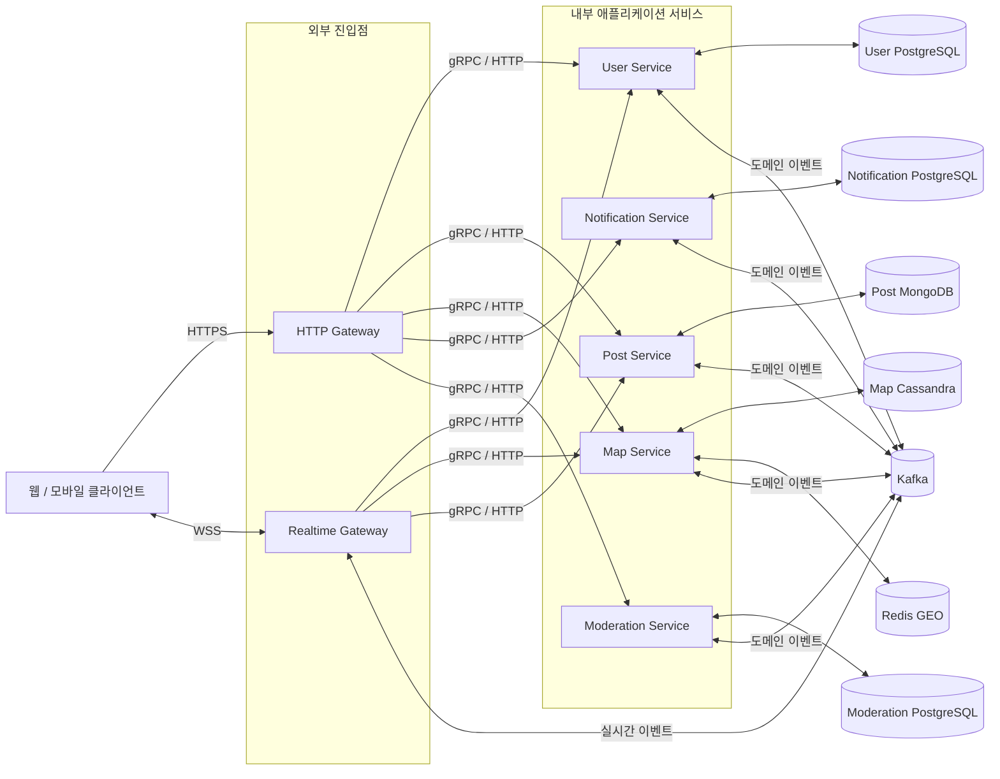
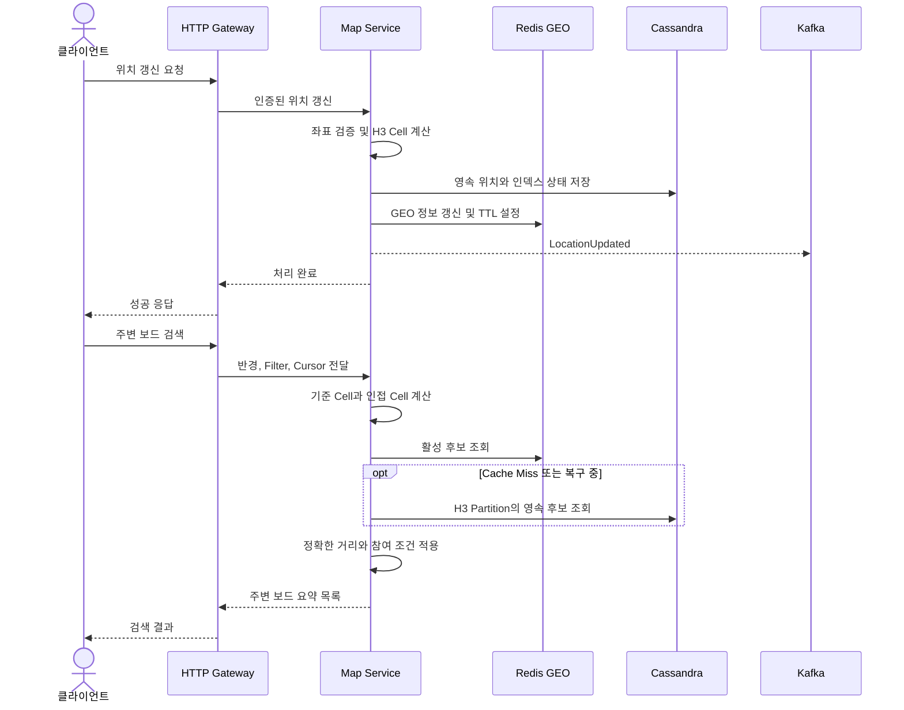
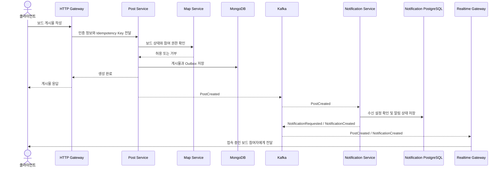
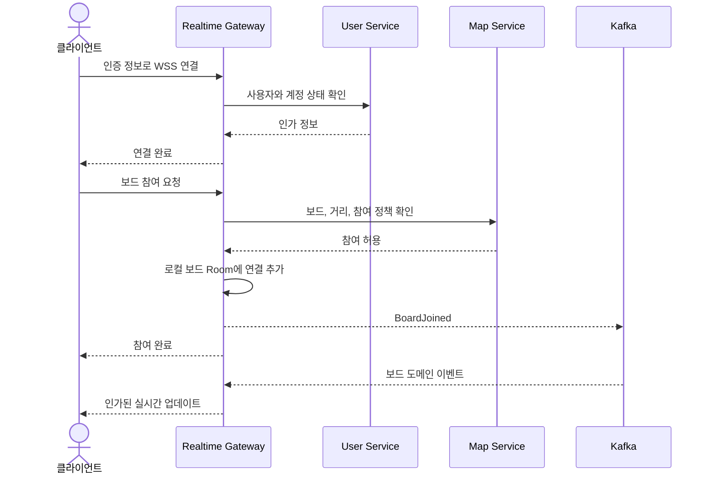

# WGO 백엔드 아키텍처

> **What's Going On(WGO)** 백엔드의 기준 아키텍처 문서다.
> 서비스 경계, 데이터 소유권, 통신 방식, 저장소 또는 배포 구조가 바뀌면
> 구현과 함께 이 문서도 갱신한다.

## 1. 시스템 개요

WGO는 위치 기반 실시간 정보 공유 서비스다. 사용자는 현재 위치 주변에
일시적으로 생성된 보드를 탐색하고 참여하며, 게시물을 작성하고 관련 알림을
받을 수 있다.

백엔드는 Node.js 기반 마이크로서비스 아키텍처이며, 다음 7개 애플리케이션을
독립적으로 배포한다.

- HTTP Gateway
- Realtime Gateway
- User Service
- Post Service
- Map Service
- Notification Service
- Moderation Service

## 2. 아키텍처 목표

- 도메인 경계와 데이터 소유권을 명확히 유지한다.
- HTTP, WebSocket, 각 도메인 부하를 독립적으로 확장한다.
- 주변 보드 검색에 짧고 예측 가능한 응답 시간을 제공한다.
- 부가 작업을 비동기로 처리하여 핵심 요청의 지연 시간을 보호한다.
- 특정 서비스나 외부 연동의 장애가 전체 시스템으로 전파되지 않게 한다.
- 멱등성과 관측 가능성을 통해 재시도와 이벤트 재처리를 안전하게 만든다.
- 애플리케이션 컨테이너를 무상태로 유지해 언제든 교체할 수 있게 한다.
- 내부 서비스와 저장소를 외부 네트워크에 직접 노출하지 않는다.

## 3. 전체 구조

외부에 공개되는 애플리케이션은 두 Gateway뿐이다. 도메인 서비스, Kafka,
Redis 및 데이터베이스는 사설 네트워크에 배치하고 명시적으로 허용한 경로로만
접근한다.

## 4. 애플리케이션별 책임

| 애플리케이션 | 소유하는 책임 | 소유하지 않는 책임 |
| --- | --- | --- |
| **HTTP Gateway** | 공개 HTTP API, 인증 적용, 요청 검증, 라우팅, 응답 조합, Rate Limit | 도메인 규칙과 영속 데이터 |
| **Realtime Gateway** | WebSocket 연결 수명주기, 인증된 연결, 보드 Room, Presence, 클라이언트 이벤트 전달 | 영속적인 보드 참여 정보, 게시물, 사용자 정보 |
| **User Service** | 사용자 신원과 프로필, 계정 상태, 사용자 도메인의 인가 정보 | 게시물, 공간 인덱스, 알림 상태 |
| **Post Service** | 보드 게시물, 필요한 경우 댓글과 답글, 콘텐츠 수명주기 및 조회 모델 | 사용자 프로필, 위치 검색, 알림 설정 |
| **Map Service** | 보드의 위치와 수명주기, 위치 갱신, H3 Cell, 주변 보드 검색, 영속·실시간 공간 인덱스 | 게시물 본문과 알림 전송 |
| **Notification Service** | 알림 기록, 사용자 알림 설정, Fan-out, 전송 시도와 상태 | 알림을 발생시킨 원본 도메인 데이터 |
| **Moderation Service** | 신고, 검토 Case, 정책 판단, 제재 결정과 감사 기록 | 게시물과 사용자 프로필 원본. 소유 서비스에 결정 적용을 요청하거나 이벤트로 알림 |

Gateway는 가능한 한 얇게 유지한다. 도메인 규칙은 해당 데이터를 소유하는
서비스가 처리한다.

## 5. 서비스 간 통신

### 5.1 동기 통신

타입 안정성이 필요하고 지연 시간에 민감한 내부 호출에는 **gRPC**를 사용한다.
상호 운용성, 운영 단순성 또는 기존 인터페이스 때문에 더 적합한 경우 내부
**HTTP**를 사용할 수 있다. 외부 클라이언트는 HTTPS 또는 WSS로 Gateway에만
접속한다.

현재 요청을 완료하기 위해 즉시 결과가 필요한 경우 동기 호출을 사용한다.

- 사용자 인증 및 인가 정보 조회
- 주변 보드 검색
- 게시물 또는 프로필 조회
- 보드 참여 가능 여부 확인

모든 내부 호출에는 Timeout 또는 Deadline을 설정한다. 재시도는 멱등성이
보장되는 작업에만 제한적으로 적용한다. 호출 체인은 짧게 유지하며 Gateway가
분산 트랜잭션을 만들지 않게 한다.

### 5.2 비동기 통신

**Kafka**는 완료된 도메인 사실을 이벤트로 전달하고 후속 작업을 원본 요청에서
분리한다. 대표적인 이벤트는 `UserUpdated`, `LocationUpdated`, `BoardCreated`,
`BoardJoined`, `PostCreated`, `ModerationDecisionApplied`,
`NotificationRequested`다.

이벤트 처리 원칙은 다음과 같다.

- 이벤트는 실행 명령이 아니라 이미 발생한 도메인 사실을 표현한다.
- Event ID, Event Type, Schema Version, 발생 시각, Producer, Correlation ID,
  Aggregate ID를 포함한다.
- 전달 방식은 **At-least-once**로 간주한다. Consumer는 멱등하게 동작하고,
  필요하면 처리한 Event ID 또는 동등한 중복 방지 상태를 저장한다.
- 데이터 변경과 이벤트 발행이 함께 필요한 Producer는 Transactional Outbox
  또는 동등하게 검증된 방식을 사용한다.
- 재시도를 제한하고 처리할 수 없는 메시지는 진단과 재처리에 필요한 문맥과
  함께 Dead Letter Topic으로 이동한다.
- Schema는 하위 호환되게 변경하며 호환되지 않는 변경에는 새 버전을 사용한다.
- 이벤트에는 식별자와 꼭 필요한 정보만 담는다. 비밀 정보나 다른 서비스의
  전체 레코드를 복제하지 않는다.

Kafka의 순서는 Partition 안에서만 보장된다. Aggregate별 순서가 필요하면
Aggregate ID를 Partition Key로 사용한다.

## 6. 데이터 소유권과 저장소

각 서비스는 자신이 소유한 데이터의 유일한 Writer다. 다른 애플리케이션은
소유 서비스의 API를 호출하거나 발행된 이벤트를 소비해 데이터에 접근한다.

| 도메인 | 소유 서비스 | 주 저장소 | 용도 |
| --- | --- | --- | --- |
| 사용자 | User Service | PostgreSQL | 신원, 프로필, 계정 상태와 관계형 제약 |
| 게시물 | Post Service | MongoDB | 문서 형태의 콘텐츠와 유연한 콘텐츠 구조 |
| 지도와 보드 위치 | Map Service | Cassandra + Redis GEO + H3 | 영속 공간 데이터와 실시간 위치 검색 |
| 알림 | Notification Service | PostgreSQL | 알림 설정, Inbox, 전송 상태 |
| 운영 및 신고 | Moderation Service | PostgreSQL | 신고, 검토, 정책 결정, 감사 이력 |

서비스별 데이터베이스는 최소한 논리적 소유권, 계정, Migration과 쓰기 권한이
분리되어야 한다. 초기에는 물리 인프라를 공유할 수 있지만, 서비스 간 직접
Table/Collection 조회, Join 및 쓰기는 허용하지 않는다.

### 6.1 Map 저장 구조: Redis GEO, H3, Cassandra

Map Service는 서로 다른 역할을 가진 세 기술을 조합한다.

- **H3**는 좌표를 결정적인 육각형 Cell ID로 변환한다. 설정된 Resolution과
  인접 Cell Ring을 이용해 검색할 후보 영역을 제한한다.
- **Cassandra**는 보드 위치, 보드 수명주기와 영속 공간 인덱스의 기준 저장소다.
  Table은 조회 패턴 중심으로 설계한다. H3 Cell과 시간 또는 Shard Bucket을
  조합해 Hot Partition과 무한히 커지는 Partition을 방지한다.
- **Redis GEO**는 활성 보드와 최근 위치를 빠르게 조회하기 위한 임시 인덱스다.
  필요한 데이터에는 TTL을 설정하며 Cassandra 또는 이벤트 재처리로 다시 만들
  수 있어야 한다.

주변 검색은 다음 순서로 처리한다.

1. 요청 좌표의 H3 Cell과 검색 반경에 필요한 인접 Cell을 계산한다.
2. Redis GEO에서 활성 후보를 조회한다.
3. Cache Miss 또는 복구 상황에서는 Cassandra의 H3 Partition을 조회한다.
4. 후보에 정확한 거리와 보드 참여 조건을 적용한다.
5. 제한된 크기의 페이지와 Cursor를 반환한다.

H3는 후보 범위를 줄이는 인덱스이며 정확한 거리 계산을 대체하지 않는다.
H3 Resolution, 검색 Ring, 위치 TTL, 최대 반경, 정밀도와 보존 기간은 운영
설정으로 관리하고 실제 밀도와 지연 시간으로 검증한다. 원본 위치 이력은 제품
및 개인정보 정책보다 오래 보관하지 않는다.

## 7. 주요 요청 흐름

### 7.1 위치 갱신과 주변 보드 검색

### 7.2 게시물 생성과 알림 Fan-out

알림 Fan-out은 비동기로 처리하며 게시물 생성 응답 시간을 늘리지 않는다.
대규모 수신자는 제한된 크기의 Batch로 처리한다. 같은 이벤트가 반복 전달되어도
사용자에게 보이는 알림이 중복 생성되지 않아야 한다.

### 7.3 WebSocket 보드 참여

WebSocket Room은 연결 상태일 뿐 영속적인 도메인 데이터가 아니다. 클라이언트는
지수 Backoff로 재연결하고 놓친 영속 상태를 HTTP로 다시 조회한다. Realtime
Gateway는 Kafka 이벤트 중 현재 연결에 허용된 정보만 전달한다. 여러 Instance에
걸친 전달이 특정 Task의 In-memory Room에 의존해서는 안 된다.

## 8. 일관성과 장애 격리

- 단일 서비스의 불변 조건은 해당 서비스의 로컬 트랜잭션으로 보호한다.
- 서비스 간 Workflow에는 이벤트와 보상 작업을 사용한다. 분산 트랜잭션과
  공유 Unit of Work는 사용하지 않는다.
- 조회 모델과 알림은 원본 도메인과 최종적 일관성을 가진다.
- 재시도될 수 있는 중요 Command는 Idempotency Key를 지원한다.
- Timeout, 동시성 제한과 Circuit Breaker로 연쇄 장애를 방지한다.
- Consumer Lag과 Dead Letter를 감시하고 재처리는 운영 절차에 따라 수행한다.
- Redis 장애는 검색 성능을 낮출 수 있지만 영속 지도 데이터를 잃게 해서는 안
  된다. Map Service는 Cassandra 또는 이벤트로 실시간 인덱스를 복원한다.
- 알림 Provider 장애가 게시물 생성을 실패시키지 않는다. Notification Service가
  시도 결과를 기록하고 정책에 따라 재시도한다.
- Realtime Gateway 장애는 해당 Task의 연결에만 영향을 준다. 클라이언트는
  정상 Task에 다시 연결하고 영속 상태를 재조회한다.

## 9. 배포와 확장

7개 애플리케이션은 각각 별도의 **ECS Fargate Service**로 배포한다. Container
Image는 불변으로 관리하고 설정과 Secret은 Runtime에 주입한다. Health Check를
통해 비정상 Task 교체와 배포 Rollout을 제어한다.

- HTTP Gateway는 요청량, 지연 시간, CPU와 Memory를 기준으로 확장한다.
- Realtime Gateway는 활성 연결 수, 이벤트 처리량, CPU와 Memory를 기준으로
  확장한다.
- 도메인 서비스는 요청 부하, Kafka Consumer Lag과 자원 사용량에 따라 확장한다.
- Kafka Consumer Group의 실질적인 최대 병렬성은 Topic Partition 수의 영향을
  받는다.
- 고가용성이 필요한 환경에서는 여러 Availability Zone을 사용한다.
- 데이터베이스, Kafka, Redis의 용량과 고가용성은 무상태 Compute와 별도로
  관리한다.

애플리케이션 Task는 로컬 Disk에 영속 상태를 저장하지 않는다. 모든 Cache는
폐기 가능해야 한다. WebSocket 연결 자체는 실행 중인 Task에 종속되지만 사용자
신원, 인가 및 복구해야 할 도메인 상태는 종속되지 않는다.

## 10. 관측 가능성

모든 애플리케이션은 공통 Service, Environment, Version Field를 포함한 구조화
Log, Metric, Distributed Trace를 제공한다. Correlation ID와 Trace ID는 HTTP,
gRPC, Kafka, WebSocket 경계를 넘어 전달한다.

최소 수집 대상은 다음과 같다.

- Route/RPC별 요청량, 오류율, 지연 시간
- 활성 WebSocket 연결, 참여, 연결 해제, 전달 실패
- Kafka 발행 실패, Consumer Lag, 재시도, Dead Letter 수
- 데이터베이스와 Redis의 지연, 오류, 포화도, Connection Pool 압력
- 알림 Fan-out 크기, 전송 상태, Provider 실패율
- ECS Task 상태, 재시작, CPU와 Memory
- 주변 보드 검색, 게시물 생성, 운영 조치 등의 비즈니스 지표

Telemetry에는 개인정보와 불필요한 정밀 위치를 포함하지 않는다. Alert는
사용자 영향을 설명하고 관련 Runbook으로 연결되어야 한다. Log에 Access Token,
Secret, 비공개 본문 또는 불필요한 원본 좌표를 기록하지 않는다.

## 11. 보안과 개인정보 경계

- 외부 연결에는 TLS를 강제하며 내부 통신도 플랫폼 정책에 따라 암호화한다.
- Gateway에서 클라이언트를 인증하되 민감한 작업의 최종 인가는 데이터를
  소유한 서비스가 수행한다. 클라이언트가 보낸 사용자 ID와 Role을 신뢰하지 않는다.
- 공개 및 비공개 Workload를 네트워크로 분리하고 최소 권한 Security Group을
  적용한다.
- 서비스마다 독립된 Runtime Identity, 데이터베이스 계정, Kafka ACL과 Secret
  접근 권한을 사용한다.
- Secret은 승인된 Secret Manager에 보관하며 Image에 포함하지 않는다.
- 입력은 Gateway와 도메인 불변 조건을 적용하는 서비스 양쪽에서 검증한다.
- HTTP 요청, WebSocket 연결과 이벤트, 위치 갱신에 Rate Limit과 Abuse Control을
  적용한다.
- 운영 조치는 감사할 수 있어야 하며 영향이 큰 조치는 명시적인 정책과 권한을
  요구한다.
- 정밀 위치는 민감 정보다. 필요한 최소 정밀도만 수집하고 접근, 보존, 삭제
  정책을 정의한다. 반드시 필요한 경우가 아니면 이벤트, Log, 분석 데이터에
  원본 좌표를 노출하지 않는다.

## 12. 주요 아키텍처 결정

| 결정 | 선택 이유 | 결과와 제약 |
| --- | --- | --- |
| 7개 애플리케이션 독립 배포 | 외부 Protocol과 도메인 부하 분리 | 배포 및 운영 조율 비용 증가 |
| 얇은 HTTP/Realtime Gateway | 진입점에 도메인 로직과 데이터가 모이는 것을 방지 | Gateway는 소유 서비스에 작업 위임 |
| 동기 통신에 gRPC/HTTP 사용 | 즉시 결과가 필요한 타입 기반 요청·응답 지원 | Deadline과 짧은 호출 체인 필수 |
| 도메인 이벤트에 Kafka 사용 | 후속 작업 분리와 독립 Consumer 지원 | 최종적 일관성, 멱등성, Outbox와 재처리 체계 필요 |
| 서비스별 데이터 소유권 | 자율성과 장애 경계 보존 | 서비스 간 DB 접근과 Join 금지 |
| Post에 MongoDB 사용 | 문서 중심이며 변화 가능한 콘텐츠 구조에 적합 | 여러 Document에 걸친 불변 조건은 별도 설계 필요 |
| User/Notification/Moderation에 PostgreSQL 사용 | 관계형 제약, 트랜잭션, 감사 데이터에 적합 | 도메인마다 계정, Schema, Migration 분리 |
| 영속 공간 조회에 Cassandra + H3 사용 | 지역 Cell 중심의 수평 확장 가능한 조회 지원 | Partition과 Hotspot을 실제 데이터로 검증해야 함 |
| 활성 공간 조회에 Redis GEO 사용 | 빠른 반경 및 후보 검색 | 기준 저장소가 아닌 만료·복구 가능한 파생 인덱스 |
| ECS Fargate와 무상태 Task 사용 | Host 관리 없이 독립 확장과 교체 가능 | 모든 영속·공유 상태를 Container 외부에 저장 |

## 13. 아키텍처 변경 규칙

다음 변경에는 아키텍처 검토와 이 문서의 갱신이 필요하다.

- 도메인 또는 데이터 소유권 이동
- 서비스, 데이터 저장소, 공개 진입점, 통신 Protocol 추가
- 새로운 동기 의존성 또는 서비스 간 Workflow 추가
- 이벤트 계약, 일관성 보장, 장애 복구 방식 변경
- 보안이나 개인정보 경계 또는 배포 구조 변경

구현에 종속적인 값은 버전 관리되는 설정과 각 서비스 문서에 기록한다. 이 문서는
시스템 전체의 경계, 책임과 아키텍처 결정에 대한 기준 문서로 유지한다.
