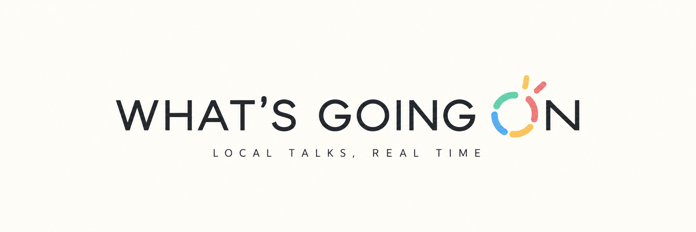
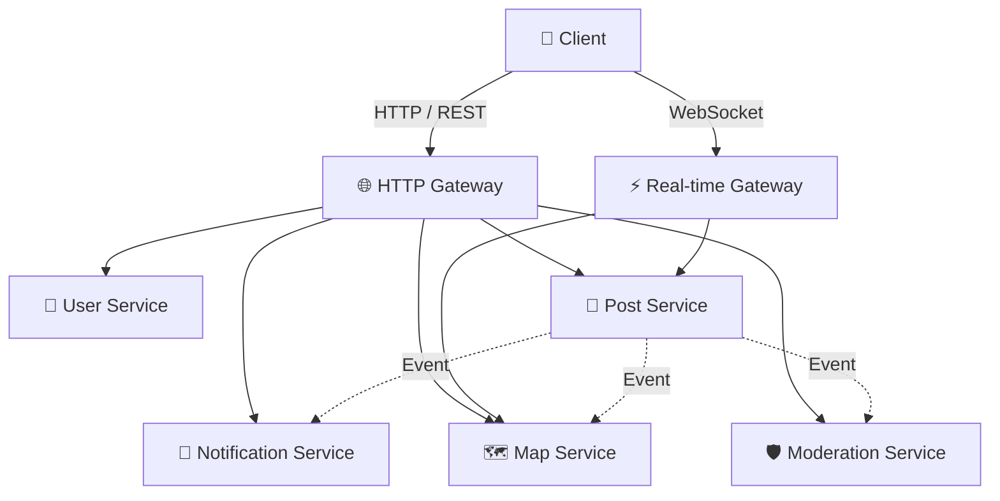

# 🌍 What's Going On — Backend

> **내 주변에서 지금 무슨 일이 일어나고 있는지, 가장 가까운 사람들과 실시간으로 공유하는 위치 기반 정보 서비스**



## 📌 Service Overview

**What's Going On**은 사용자의 현재 위치를 기반으로 주변에서 발생하고 있는 사건, 행사, 혼잡도, 로컬 정보 등을 실시간으로 공유할 수 있는 **Location-based Live Board Service**입니다.

사용자는 현재 위치 주변에 생성된 실시간 게시판을 확인하거나 직접 게시판을 생성하여 주변 사용자들과 정보를 공유할 수 있습니다.

예를 들어,

- 🚨 "여기 왜 경찰차와 소방차가 많이 와있지?"
- 👥 "지금 여기 왜 이렇게 사람이 많지?"
- 🏢 "이 장소 지금 많이 붐비나요?"
- 🍜 "이 근처 사람들만 아는 맛집이 있나요?"

와 같은 **현재 위치에서 발생하는 궁금증을 현장에 있는 사용자들과 해결하는 것**을 목표로 합니다.

---

## 🏗️ Backend Architecture

What's Going On Backend는 **Microservice Architecture(MSA)** 와 **Event-Driven Architecture**를 기반으로 설계합니다.

하나의 Backend Repository 안에 총 **7개의 독립적인 애플리케이션**을 구성합니다.

### 🚪 Gateway

- **HTTP Gateway**
    - REST API 요청 처리
    - 인증 및 인가
    - 서비스 라우팅

- **Real-time Gateway**
    - WebSocket Connection 관리
    - 실시간 게시판 이벤트 전달
    - 사용자 Join / Leave 관리

### 🧩 Domain Services

- 👤 **User Service**
    - 사용자 인증 및 계정 관리

- 📝 **Post Service**
    - 실시간 게시판 및 게시글 관리

- 🗺️ **Map Service**
    - 사용자 위치 및 주변 사용자 탐색

- 🔔 **Notification Service**
    - 주변 게시판 및 사용자 알림 관리

- 🛡️ **Moderation Service**
    - 신고 및 게시판 운영 정책 관리

---

## 📂 Repository Structure

```text
backend/
│
├── gateways/
│   ├── http-gateway/
│   └── realtime-gateway/
│
├── services/
│   ├── user-service/
│   ├── post-service/
│   ├── map-service/
│   ├── notification-service/
│   └── moderation-service/
│
└── README.md
```

각 서비스는 하나의 Repository에서 관리하지만, **독립적으로 실행되고 확장될 수 있는 애플리케이션**으로 구현합니다.

---

## 🔄 Architecture Overview



서비스 간 통신은 요청의 특성에 따라 **동기 통신과 비동기 이벤트 통신**을 구분하여 사용합니다.

각 서비스는 자신의 도메인과 데이터를 독립적으로 관리하며, 특정 서비스의 트래픽 증가가 전체 시스템에 미치는 영향을 최소화할 수 있도록 설계합니다.

---

## 🎯 Backend Goal

What's Going On Backend는 단순한 CRUD 서버가 아니라,

> **위치 기반 서비스 + 실시간 통신 + 대규모 쓰기 트래픽 + 분산 시스템**

환경을 안정적으로 처리할 수 있는 확장 가능한 Backend Architecture 구축을 목표로 합니다.
