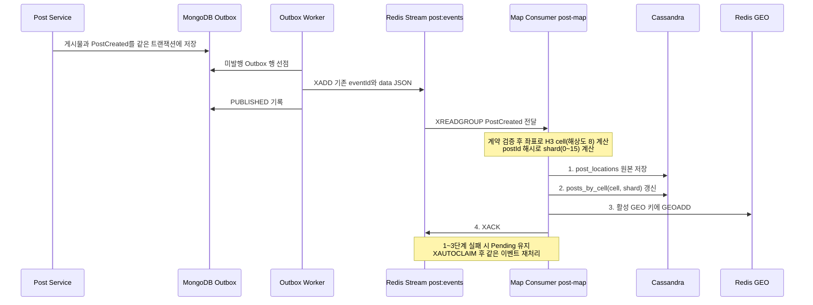
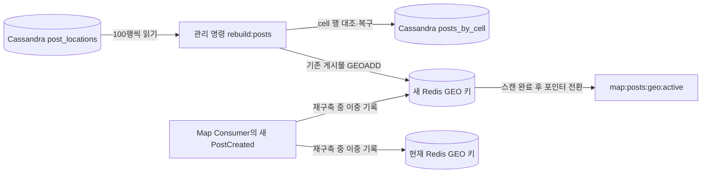

# WGO Map Service

Map Service owns the latest user location. `PUT /api/v1/location` accepts `{ "latitude": 37.5, "longitude": 127 }` with `X-User-Id` in local and test environments. Production returns 503 until Gateway user authentication is integrated. Cassandra is the source of truth; Redis caches each location for at most five minutes.

The location endpoint returns 200 with `latitude`, `longitude`, and server assigned `updatedAt`; invalid input returns 400, missing local identity 403, and unavailable storage 503.

`MapAuthorization.CheckPostCreation` and `CheckPostParticipation` are read-only gRPC calls on port 50051. They require an HS256 service JWT in `authorization: Bearer ...` with issuer `wgo-post-service`, audience `wgo-map-service`, subject `post-service`, and a lifetime of at most 60 seconds. Decisions return `allowed` and `reason` (`LOCATION_MISSING`, `LOCATION_STALE`, `OUTSIDE_RADIUS`). Checks use a location updated within five minutes and exact great-circle distance. Participation uses the post center and radius supplied by Post Service; the post ID is validated. The post spatial index is updated later by `PostCreated`.

Start local stores with `docker compose up -d`, wait for Cassandra's health check, then apply `docker cp schema.cql map-service-cassandra-1:/tmp/schema.cql` and `docker compose exec -T cassandra cqlsh -f /tmp/schema.cql`. Set variables from `.env.example` and run `pnpm dev`. `pnpm test`, `pnpm typecheck`, and `pnpm build` verify the service.

## Interface and API documentation

| Feature | Boundary | Contract |
| --- | --- | --- |
| `PUT /api/v1/location` | HTTP Gateway routes to Map; local/test only, production returns 503 | [OpenAPI](./contracts/map-http.openapi.json), Swagger UI at `http://localhost:3003/docs` and JSON at `/docs/openapi.json` |
| `MapAuthorization` creation and participation checks | Internal Post Service → Map gRPC | [Protocol Buffers](./contracts/map-authorization.proto), [auth and error semantics](./contracts/map-authorization.md) |
| `PostCreated`, `PostExpired`, `PostDeleted` projection | Internal Redis Stream `post:events` → Map Consumer | [event contract](./contracts/post-events.md), [creation schema](./contracts/post-created.schema.json), [status schema](./contracts/post-status.schema.json) |
| `GET /internal/v1/posts/nearby` | HTTP Gateway → Map | [OpenAPI](./contracts/map-http.openapi.json) |
| Cassandra/H3/Redis GEO index and `pnpm rebuild:posts` | Map internal storage and operator command | [schema](./schema.cql), rebuild procedure below |

Swagger documents HTTP only. `/docs` is served directly by Map Service and is not routed through HTTP Gateway. Nearby search is an internal Map endpoint; Gateway issuance of its JWT and public response composition are follow-up work.

## Nearby ACTIVE posts

`GET /internal/v1/posts/nearby?latitude=37.4979&longitude=127.0276&radiusM=250` requires `authorization: Bearer <JWT>` in every environment. Set a separate `MAP_GATEWAY_JWT_SECRET` of at least 32 characters. The HS256 JWT must have issuer `wgo-http-gateway`, audience `wgo-map-service`, subject `http-gateway`, and a lifetime of at most 60 seconds. Radius is 150, 250, or 350m; `limit` defaults to 20 and is at most 100; `cursor` is optional. Response is `{ "items": [{ "postId": "...", "distanceM": 42 }], "nextCursor": null }`, ordered by exact center distance and then post ID. The cursor is bound to the search coordinates and radius. Invalid JWT is 401, invalid query or cursor 400, and required Cassandra read failure 503.

Map reads candidates from the current Redis GEO index, then confirms location, `ACTIVE` status, and expiry in Cassandra. If Redis fails or yields no valid candidate, Map checks the center H3 resolution 8 cell and two surrounding rings in `posts_by_cell`. Partial GEO loss can omit posts while other valid candidates remain until `pnpm rebuild:posts` repairs the index. Redis GEO cannot store latitudes outside its supported range; Map keeps these posts in Cassandra and searches polar coordinates through H3. Map status is the last status event applied locally, so propagation can lag Post Service. Post Service does not yet emit expiry/deletion events.

## Post spatial index

Set `REDIS_URL` to the **same Redis instance as Post Service** so Map can consume `post:events`. The local Map compose Redis uses port 6381; when running Post Service's Redis on port 6380, set `REDIS_URL=redis://localhost:6380` instead. The same connection holds the location cache and GEO index. Apply the updated `schema.cql` before starting the service. The `post-map` Consumer Group starts at Stream ID `0` when first created, uses `XREADGROUP`, and reclaims idle Pending entries with `XAUTOCLAIM`. Multiple Map instances share the group.

For `PostCreated`, Stream fields are `eventId`, `eventType`, and `data`. `data` is JSON with `eventId`, `eventType: "PostCreated"`, `schemaVersion: 1`, `producer: "post-service"`, `aggregateId`, and `post: { postId, authorId, latitude, longitude, radiusM, category, expiresAt }`. IDs in the Stream fields and JSON must match. `expiresAt` is an ISO date or `null`. The [event contract](./contracts/post-events.md) defines the complete shape and Dead Letter fields. Invalid events go to `map:post:dead`; other event types are ACKed. After five failed deliveries, the original Stream ID, event ID, payload and error are written to that Dead Letter Stream before ACK. Check the logged `post-map metrics` every 30 seconds for Pending count, oldest idle time, processing failures, and Dead Letter count.

Cassandra `post_locations` is Map's location recovery source and records `event_id`; `post_status` is its local status projection. `posts_by_cell` is an H3 cell and 16 shard lookup table. H3 resolution is fixed at **8**; changing it requires rebuilding the cell index. A successful creation delivery initializes status, writes the source and cell rows, writes eligible coordinates to Redis GEO, then ACKs. Status events update the projection and remove the ID from current and rebuilding GEO keys before ACK. Redis GEO is a derived index; reads always confirm Cassandra status.

### 게시물 생성부터 공간 인덱스까지

H3는 좌표를 cell ID로 변환하는 계산이며 별도의 저장소가 아니다. `posts_by_cell`은 GEO 장애·빈 결과에서 주변 후보를 찾기 위한 Cassandra 조회 테이블이다. Redis GEO는 게시물 ID와 좌표를 담는 빠른 거리 후보 인덱스이며 Cassandra 원본에서 다시 만들 수 있다. GEO에 ID가 남아 있어도 검색은 Cassandra의 `ACTIVE` 상태와 만료 시각을 확인한다.

Outbox 발행 실패 시 Worker는 **같은 Outbox 행과 같은 `eventId`**로 재시도한다. 새 도메인 이벤트를 만들지 않는다. `XADD`는 성공했지만 `PUBLISHED` 기록이 실패하면 같은 `eventId`가 다른 Stream ID로 다시 발행될 수 있다. Map은 게시물 ID의 동일한 값을 재기록해 이 중복을 처리한다. Map의 저장 실패는 Post Outbox를 다시 생성하지 않으며, Map Consumer의 Pending 회수와 제한된 재시도로 복구한다. 이미 `PUBLISHED`로 기록한 뒤 Stream 데이터 자체가 유실된 경우에는 자동 재발행되지 않으며 Post 원본 대조와 재발행이 별도로 필요하다.

To restore a lost GEO index or repair cell rows, run `pnpm rebuild:posts` with the same Cassandra and Redis settings while consumers remain running. It pages through `post_locations`, upserts cell rows and builds a separate `map:posts:geo:build:*` key. Consumer GEO writes go to both current and build keys during the scan. A Redis script switches `map:posts:geo:active` after the scan; readers must resolve that pointer, falling back to `map:posts:geo:v1` if absent. The old GEO key may then be removed. Only one rebuild runs at a time. If the command is killed, inspect `map:posts:geo:rebuild` and remove that marker after confirming no rebuild is running; then rerun the command. Startup does not scan Cassandra. If the Stream event was lost before Map consumed it, reconcile against Post Service's source data and republish separately.

Run the store backed tests with `RUN_INTEGRATION=1 pnpm test` after applying `schema.cql`. They use Redis database 15 and write test posts to Cassandra.
