# Post Service

Nest.js 기반으로 복잡한 비즈니스 로직들 처리.

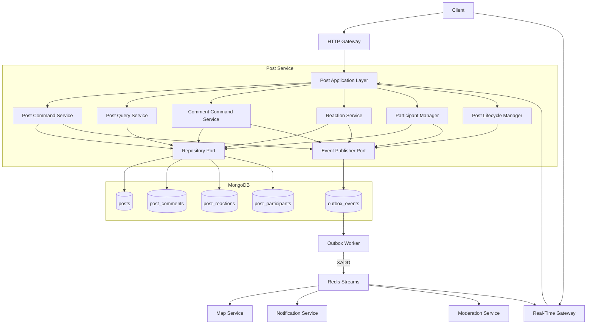

# Post Service

## 서비스의 책임 분리

> 게시판의 생성, 내용, 상태, 댓글, 반응, 참여자와 같은 **Post Domain의 Source of Truth를 소유하는 서비스**

```text
Map Service  : Where?
Post Service : What?
```

Map Service는 **"어디에 게시판이 존재하는가?"** 를 담당하고,

Post Service는 **"그 게시판이 무엇인가?"** 를 담당한다.

즉 다음과 같이 서비스의 책임을 분리한다.

```
"내 주변 150m / 250m / 350m에 어떤 게시판이 존재하는가?"
→ Map Service

"postId = xxx인 게시판의 내용은 무엇인가?"
→ Post Service

"게시판의 댓글은 무엇인가?"
→ Post Service

"누가 좋아요를 눌렀는가?"
→ Post Service

"게시판이 ACTIVE / EXPIRED / DELETED 상태인가?"
→ Post Service

"게시판 근처에 어떤 사용자가 있는가?"
→ Map Service
```

Post Service는 게시판 생성 당시의 위치 정보를 Snapshot 형태로 저장할 수 있지만,

**Geospatial Index와 거리 기반 검색은 소유하지 않는다.**

즉 MongoDB의 `2dsphere`, $near, $geoNear 등을 이용해 주변 게시판을 직접 검색하지 않는다.

공간 검색은 Map Service가 담당하고, Post Service는 전달받은 Post ID를 이용해 게시판의 상세 정보를 반환한다.

---

# Post Service 전체 구조


Post Service는 게시판과 관련된 데이터의 Source of Truth이며,

다른 Service에서 게시판의 변경사항이 필요한 경우 MongoDB Outbox Worker가 Redis Streams에 발행한 도메인 이벤트로 전달한다.

---

# 주요 기능

## 1. 게시판 생성

### POST `/api/v1/posts`

사용자가 새로운 게시판을 생성한다.

게시판 생성은 다음과 같은 흐름으로 처리한다.

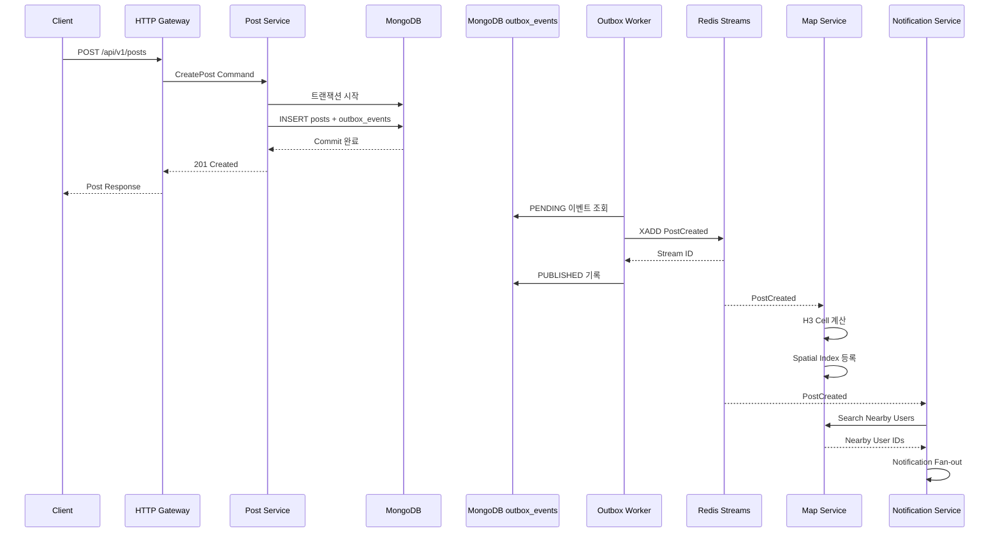

게시판이 생성되면 Post Service가 직접 Redis GEO에 게시판을 등록하지 않는다.

Post Service의 책임은 다음 이벤트를 발생시키는 것까지이다.

```
PostCreated
```

이후 게시판의 공간 인덱스 등록은 Map Service가 처리한다.

### PostCreated Event

```
{
  "eventId": "evt_01J...",
  "eventType": "PostCreated",
  "schemaVersion": 1,
  "producer": "post-service",
  "aggregateId": "post_01J...",
  "correlationId": "req_01J...",
  "occurredAt": "2026-09-19T01:00:00Z",

  "post": {
    "postId": "post_01J...",
    "authorId": 123,
    "latitude": 37.4979,
    "longitude": 127.0276,
    "radiusM": 250,
    "category": "INCIDENT",
    "expiresAt": "2026-09-19T03:00:00Z"
  }
}
```

`radiusM`은 게시판 생성 시 사용자가 선택한 게시판 참여 / 노출 반경이다.

예를 들어 다음과 같이 사용할 수 있다.

```
150m
250m
350m
```

---

# 2. 주변 게시판 조회

### GET `/api/v1/posts/nearby`

주변 게시판 조회는 Post Service 하나에서 수행하지 않는다.

Map Service 문서에서 정의한 것처럼 서비스 책임을 다음과 같이 나눈다.

```
Map Service
→ 주변 Post ID 탐색

Post Service
→ Post 상세 데이터 조회
```

전체 요청은 Gateway에서 Composition한다.

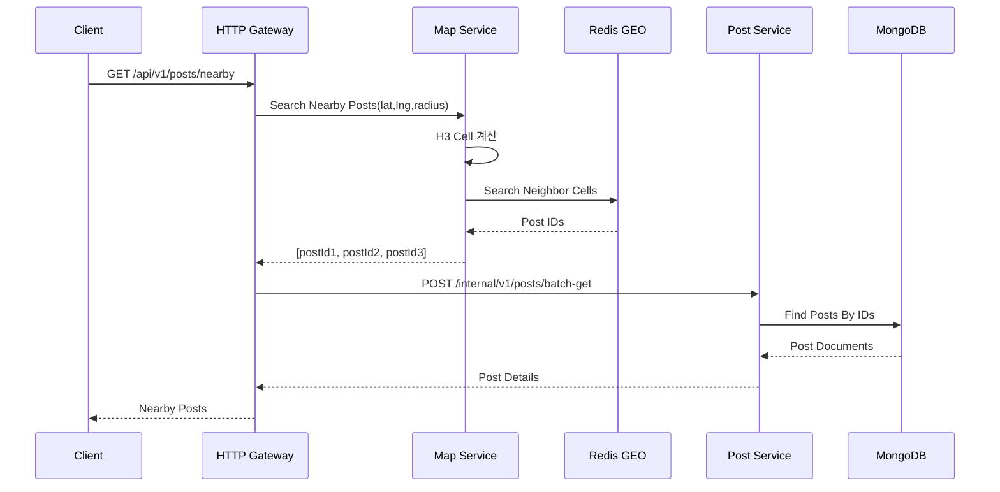

Post Service가 수행하는 MongoDB Query는 다음과 같은 형태이다.

```
db.posts.find({
  postId: {
    $in: [
      "post-1",
      "post-2",
      "post-3"
    ]
  },

  status: "ACTIVE"
})
```

Post Service는 위도 / 경도를 기준으로 주변 게시판을 검색하지 않는다.

---

# 3. 게시판 상세 조회

### GET `/api/v1/posts/{postId}`

사용자가 게시판 하나의 상세 정보를 조회한다.

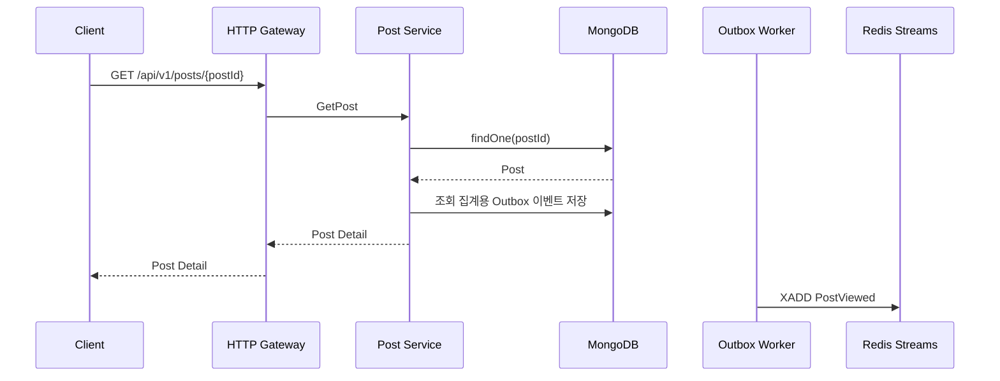

게시판 조회 횟수를 증가시키기 위해 매번 다음과 같은 Query를 수행하는 것은 피한다.

```
db.posts.updateOne(
  {
    postId: postId
  },
  {
    $inc: {
      "counters.viewCount": 1
    }
  }
)
```

하나의 인기 게시판에 조회가 몰리는 경우 특정 Document에 지속적으로 Write가 집중될 수 있다.

따라서 조회 횟수는 Event 기반으로 비동기 집계한다.

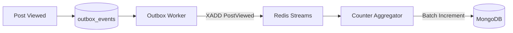

즉 다음과 같은 Eventual Consistency를 허용한다.

```
PostViewed
    ↓
MongoDB Outbox
    ↓
Outbox Worker → Redis Streams
    ↓
Counter Aggregator
    ↓
Batch Update
    ↓
MongoDB
```

---

# 4. 실시간 게시판 참여

게시판의 실시간 연결 자체는 Real-Time Gateway가 관리한다.

Post Service는 다음 정보만 관리한다.

```
게시판이 현재 ACTIVE 상태인가?

사용자가 참여 가능한 게시판인가?

어떤 사용자가 게시판에 참여했는가?
```

WebSocket Connection, Socket ID, 서버별 Connection 상태 등은 Real-Time Gateway가 관리한다.

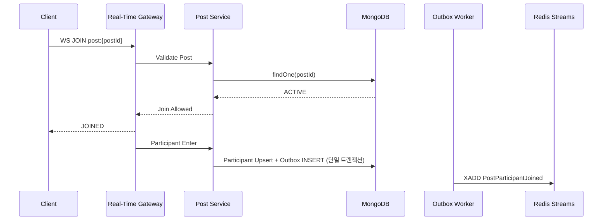

서비스 책임은 다음과 같이 구분한다.

```
Real-Time Gateway

- WebSocket Connection
- Socket Routing
- Room
- 실시간 Broadcast

Post Service

- Post 상태
- Post 유효성
- Participant 정보
- Post Domain
```

---

# 5. 댓글 작성

게시판의 댓글은 Write 비율이 매우 높은 데이터가 될 가능성이 있다.

따라서 댓글을 `posts` Document 내부 Array로 저장하지 않는다.

다음과 같은 구조는 사용하지 않는다.

```
{
  "postId": "post-1",

  "comments": [
    {
      "commentId": "1"
    },

    {
      "commentId": "2"
    }
  ]
}
```

댓글이 계속 증가하게 되면 하나의 Document가 매우 커지고 동일 Document에 Write가 집중된다.

따라서 댓글은 별도의 `post_comments` Collection으로 분리한다.

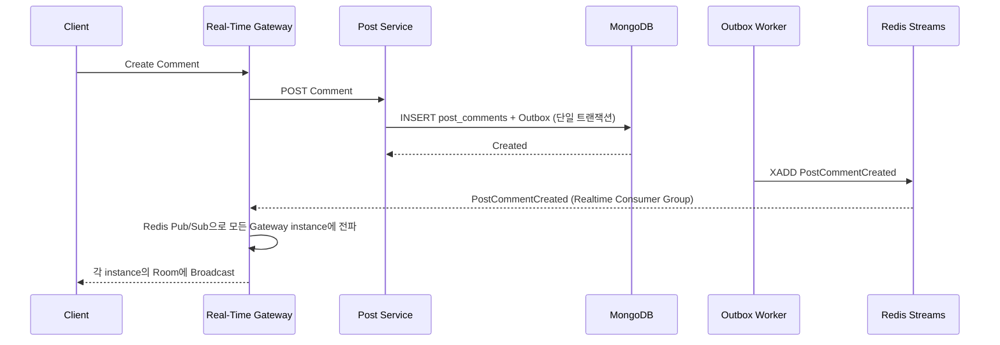

댓글을 작성하면 Post Service가 같은 MongoDB 트랜잭션에서 댓글과 Outbox를 저장한다. Outbox Worker가 `PostCommentCreated`를 Redis Streams에 발행한다.

Real-Time Gateway는 해당 이벤트를 Subscribe하고 게시판에 연결되어 있는 사용자들에게 WebSocket으로 전달한다.

```
Post Service
      ↓
Redis Streams
      ↓
Realtime Consumer Group → Redis Pub/Sub
      ↓
Real-Time Gateway A
Real-Time Gateway B
Real-Time Gateway C
      ↓
WebSocket Client
```

---

# 6. 게시판 Reaction

좋아요와 같은 Reaction 역시 `posts` Document 내부에 사용자 ID Array를 저장하지 않는다.

다음과 같은 구조는 사용하지 않는다.

```
{
  "postId": "post-1",

  "likedUsers": [
    1,
    2,
    3,
    4
  ]
}
```

대신 별도의 `post_reactions` Collection을 사용한다.

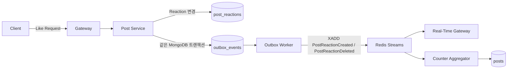

---

# 7. 게시판 Lifecycle

What's Going On의 게시판은 일반적인 커뮤니티 게시판과 달리 실시간 상황을 전달하기 위한 게시판이다.

따라서 게시판은 영구적으로 ACTIVE 상태를 유지하지 않는다.

게시판은 다음과 같은 상태를 가진다.

```
ACTIVE

EXPIRED

DELETED

HIDDEN
```

대표적인 상태 변경은 다음과 같다.

```
ACTIVE
  ↓
EXPIRED

ACTIVE
  ↓
DELETED

ACTIVE
  ↓
HIDDEN
```

게시판 만료 흐름은 다음과 같다.

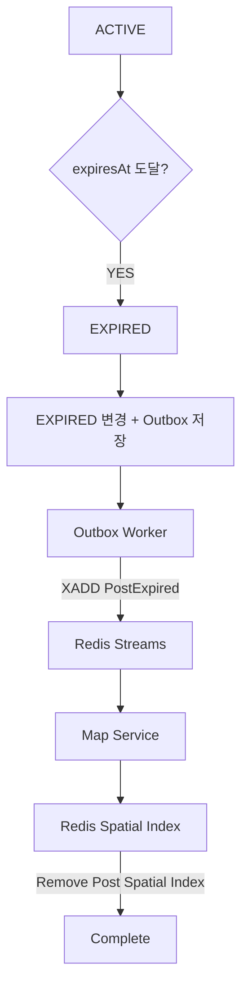

MongoDB TTL을 이용해 게시판 자체를 바로 삭제하는 것은 권장하지 않는다.

MongoDB에서 Post가 바로 삭제되면 Map Service에 `PostExpired` Event를 전달하기 어려워진다.

따라서 다음과 같은 흐름을 사용한다.

```
expiresAt 도달
       ↓
Lifecycle Worker
       ↓
status = EXPIRED
       ↓
같은 MongoDB 트랜잭션에서 PostExpired Outbox 저장
       ↓
Outbox Worker → Redis Streams
       ↓
Map Service
       ↓
Spatial Index 제거
```

이후 일정 기간이 지난 EXPIRED 게시판에 대해서만 MongoDB TTL 등을 이용해 Physical Delete를 수행할 수 있다.

---

# MongoDB 사용 이유

Post Service는 다음과 같은 특징을 가진다.

| 특성 | Post Service |
| --- | --- |
| Write 빈도 | 높음 |
| 데이터 구조 | 게시글 / 댓글 / Reaction / Participant |
| Schema 변화 | 비교적 많음 |
| JOIN | 거의 없음 |
| Transaction | 일부 필요 |
| Scale-out | 필요 |
| 주요 조회 조건 | postId |
| 데이터 모델 | Document 중심 |

MongoDB를 선택하는 핵심 이유를 단순히

```
Write가 많기 때문에 MongoDB를 사용한다.
```

라고 설명하는 것은 충분하지 않다.

다음과 같이 설명하는 것이 더 적절하다.

> Post Service는 게시글, 댓글, 반응과 같이 데이터 구조가 빠르게 확장될 수 있고 대부분의 조회가 특정 `postId`를 중심으로 수행된다.
> 
> 
> 관계형 JOIN보다 독립적인 Document 단위의 조회와 Write가 많으며, 게시판과 댓글 트래픽 증가에 따른 Horizontal Scale-out이 필요하다.
> 
> 따라서 유연한 Document Model과 Sharding을 지원하는 MongoDB를 Post Service의 Primary Database로 사용한다.
> 

---

# MongoDB Data Model

```
MongoDB
│
├── posts
│
├── post_comments
│
├── post_reactions
│
├── post_participants
│
└── outbox_events
```

---

# 1. posts

게시판 자체의 Source of Truth이다.

```
{
  "_id": "ObjectId",

  "postId": "post_01J...",

  "authorId": 123,

  "category": "INCIDENT",

  "title": "여기 무슨 일인가요?",

  "content": "119랑 경찰차가 많이 와있어요.",

  "status": "ACTIVE",

  "locationSnapshot": {
    "latitude": 37.4979,
    "longitude": 127.0276,
    "h3CellId": "8830e1..."
  },

  "radiusM": 250,

  "counters": {
    "viewCount": 124,
    "commentCount": 17,
    "reactionCount": 8,
    "participantCount": 31
  },

  "createdAt": "2026-09-19T01:00:00Z",

  "updatedAt": "2026-09-19T01:10:00Z",

  "expiresAt": "2026-09-19T03:00:00Z"
}
```

`locationSnapshot`은 게시판 생성 당시 위치를 저장한다.

하지만 Post Service가 이 정보를 이용해 Geospatial Search를 수행하지 않는다.

게시판의 공간 검색은 Map Service가 담당한다.

### Index

```
db.posts.createIndex(
  {
    postId: 1
  },
  {
    unique: true
  }
)

db.posts.createIndex({
  authorId: 1,
  createdAt: -1
})

db.posts.createIndex({
  status: 1,
  expiresAt: 1
})

db.posts.createIndex({
  category: 1,
  createdAt: -1
})
```

---

# 2. post_comments

게시판 댓글을 저장한다.

```
{
  "_id": "ObjectId",

  "commentId": "comment_01J...",

  "postId": "post_01J...",

  "authorId": 827,

  "content": "방금 구급차 한 대 더 왔어요.",

  "status": "ACTIVE",

  "createdAt": "2026-09-19T01:13:00Z",

  "updatedAt": null
}
```

### Index

```
db.post_comments.createIndex(
  {
    postId: 1,
    createdAt: -1,
    _id: -1
  }
)

db.post_comments.createIndex(
  {
    commentId: 1
  },
  {
    unique: true
  }
)
```

댓글 조회는 Offset Pagination보다 Cursor Pagination을 사용한다.

```
GET /api/v1/posts/{postId}/comments
    ?cursor=xxx
    &limit=30
```

`skip / limit` 방식은 댓글 개수가 많아질수록 성능이 저하될 수 있다.

---

# 3. post_reactions

게시판에 대한 Reaction 정보를 저장한다.

```
{
  "_id": "ObjectId",

  "postId": "post_01J...",

  "userId": 123,

  "type": "LIKE",

  "createdAt": "2026-09-19T01:15:00Z"
}
```

### Index

```
db.post_reactions.createIndex(
  {
    postId: 1,
    userId: 1,
    type: 1
  },
  {
    unique: true
  }
)
```

이를 통해 다음 관계를 Database 수준에서 보장할 수 있다.

```
한 사용자

+

한 게시판

+

한 Reaction Type

=

하나의 Reaction
```

---

# 4. post_participants

실시간 게시판에 참여했던 사용자를 관리한다.

```
{
  "_id": "ObjectId",

  "postId": "post_01J...",

  "userId": 123,

  "joinedAt": "2026-09-19T01:04:00Z",

  "lastSeenAt": "2026-09-19T01:20:00Z",

  "leftAt": null
}
```

### Index

```
db.post_participants.createIndex(
  {
    postId: 1,
    userId: 1
  },
  {
    unique: true
  }
)

db.post_participants.createIndex({
  postId: 1,
  joinedAt: -1
})
```

`post_participants`의 Source of Truth는 Post Service에 둔다.

Map Service가 특정 분석이나 위치 이력 목적으로 Participant 데이터가 필요하다면 Redis Streams Event를 통해 필요한 정보만 복제한다.

---

# 5. outbox_events

MongoDB 도메인 데이터 변경과 Redis Streams 발행 사이의 불일치를 방지하기 위해 사용한다. 도메인 데이터와 Outbox 문서를 동일한 MongoDB 트랜잭션에서 기록한다. MongoDB 트랜잭션을 위해 Replica Set이 필요하다.

다음과 같은 상황이 발생할 수 있다.

```
MongoDB INSERT 성공
        ↓
Application 장애
        ↓
Redis Streams XADD 미실행
```

그러면 Post Service에는 게시판이 존재하지만 Map Service에는 해당 게시판이 존재하지 않는 상태가 발생할 수 있다.

이를 해결하기 위해 Transactional Outbox Pattern을 사용한다.

### Document

```
{
  "_id": "ObjectId",

  "eventId": "evt_01J...",

  "aggregateId": "post_01J...",

  "eventType": "PostCreated",

  "schemaVersion": 1,

  "producer": "post-service",

  "correlationId": "req_01J...",

  "occurredAt": "2026-09-19T01:00:00Z",

  "payload": {},

  "status": "PENDING",

  "claimedBy": null,

  "claimedUntil": null,

  "attemptCount": 0,

  "nextAttemptAt": "2026-09-19T01:00:00Z",

  "createdAt": "2026-09-19T01:00:00Z",

  "publishedAt": null,

  "streamId": null
}
```

### 구조

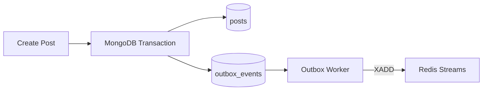

게시판을 생성할 때 같은 MongoDB Transaction 안에서 다음 작업을 처리한다.

```
INSERT posts

+

INSERT outbox_events
```

Outbox Worker는 발행 시각이 된 `PENDING` 이벤트를 읽어 Redis Streams에 `XADD`한다. 여러 Worker가 실행될 수 있으므로 이벤트를 원자적으로 `PUBLISHING` 상태로 선점하고 `claimedUntil` 만료 시 재처리한다. 발행 실패 시 시도 횟수와 다음 재시도 시각을 기록하고 `PENDING`으로 되돌린다.

`XADD`가 반환한 Stream ID를 저장하고 상태를 변경한다.

```
PENDING
   ↓
PUBLISHING
   ↓
PUBLISHED
```

`XADD` 성공 후 `PUBLISHED` 저장 전에 Worker가 중단되면 동일 `eventId`가 다시 발행될 수 있다. 따라서 전송은 at-least-once로 취급한다. Outbox의 `eventId`는 재시도에서도 유지하며, Consumer는 이 값으로 중복을 제거한다. `status`/`nextAttemptAt`과 `claimedUntil` 조회 인덱스, `eventId` 고유 인덱스를 둔다. 발행 완료 기록은 복구에 필요한 기간 동안 보존한 뒤 정리한다.

`PostCreated`, `PostUpdated`, `PostDeleted`, `PostExpired`, 댓글, 반응, 참여 상태 변경 등 영속 상태의 변경은 모두 같은 방식으로 Outbox에 기록한다. 만료 Worker도 `ACTIVE → EXPIRED` 상태 변경과 `PostExpired` Outbox 기록을 하나의 트랜잭션으로 처리한다. 상태 전이 조건으로 중복 만료 이벤트 생성을 막는다.

---

# MongoDB Sharding 전략

Post Service의 가장 기본적인 조회 패턴은 다음과 같다.

```
postId
   ↓
Post 조회
```

Map Service 역시 주변 게시판을 조회한 이후 Post ID 목록을 반환한다.

따라서 MongoDB의 기본 Shard Key 후보는 다음과 같다.

```
postId hashed
```

예시:

```
sh.shardCollection(
  "post.posts",
  {
    postId: "hashed"
  }
)
```

논리적으로는 다음과 같이 분산될 수 있다.

```
MongoDB Cluster

Shard 1
├── post-A
└── post-D

Shard 2
├── post-B
└── post-F

Shard 3
├── post-C
└── post-G
```

이를 통해 서로 다른 게시판에 대한 Read / Write를 여러 Shard에 분산할 수 있다.

---

# Hot Post 문제

하지만 하나의 게시판에 매우 많은 트래픽이 집중되는 경우에는 `postId` 기반 분산만으로 모든 문제를 해결할 수 없다.

예를 들어:

```
post-A comment
post-A comment
post-A comment
post-A comment
post-A comment
```

모든 댓글이 하나의 `postId`를 기준으로 Write되면 특정 Shard에 부하가 집중될 수 있다.

향후 대규모 트래픽이 발생한다면 다음과 같은 Time Bucket을 추가할 수 있다.

```
post-A:2026091901

post-A:2026091902

post-A:2026091903
```

논리적인 Partition Key는 다음과 같이 구성할 수 있다.

```
postId + timeBucket
```

하지만 MVP 단계에서는 지나친 Sharding 최적화를 먼저 적용하지 않는다.

우선 다음 수준으로 구현한다.

```
MongoDB Replica Set

+

Post ID Index

+

Cursor Pagination

+

Event-driven Counter

+

부하 테스트
```

이후 실제 Hotspot이 확인되면 Sharding 전략을 적용한다.

---

# API 명세

## Client-facing API

| Method | Endpoint | 목적 |
| --- | --- | --- |
| POST | `/api/v1/posts` | 게시판 생성 |
| GET | `/api/v1/posts/{postId}` | 게시판 상세 조회 |
| GET | `/api/v1/posts/nearby` | 주변 게시판 조회 |
| PATCH | `/api/v1/posts/{postId}` | 게시판 수정 |
| DELETE | `/api/v1/posts/{postId}` | 게시판 삭제 |
| GET | `/api/v1/posts/{postId}/comments` | 댓글 조회 |
| POST | `/api/v1/posts/{postId}/comments` | 댓글 작성 |
| DELETE | `/api/v1/posts/{postId}/comments/{commentId}` | 댓글 삭제 |
| PUT | `/api/v1/posts/{postId}/reactions/like` | 좋아요 |
| DELETE | `/api/v1/posts/{postId}/reactions/like` | 좋아요 취소 |
| POST | `/api/v1/posts/{postId}/join` | 게시판 참여 |
| POST | `/api/v1/posts/{postId}/leave` | 게시판 참여 종료 |

---

# GET /api/v1/posts/nearby 주의사항

`GET /api/v1/posts/nearby`는 Client-facing Endpoint이지만 실제로 Post Service 하나에서 처리하지 않는다.

Gateway Composition 방식으로 처리한다.

```
flowchart LR

    C[Client]

    G[HTTP Gateway]

    MAP[Map Service]

    P[Post Service]

    C -->|GET /posts/nearby| G

    G -->|lat lng radius| MAP

    MAP -->|Post IDs| G

    G -->|Batch Get| P

    P -->|Post Details| G

    G --> C
```

---

# Internal API

| Method | Endpoint | 호출자 | 목적 |
| --- | --- | --- | --- |
| POST | `/internal/v1/posts/batch-get` | HTTP Gateway | Post ID 목록을 이용한 상세 조회 |
| GET | `/internal/v1/posts/{postId}/meta` | Real-Time Gateway | 게시판 기본 정보 및 상태 검증 |
| POST | `/internal/v1/posts/{postId}/participants` | Real-Time Gateway | 참여자 등록 |
| DELETE | `/internal/v1/posts/{postId}/participants/{userId}` | Real-Time Gateway | 참여 종료 |
| PATCH | `/internal/v1/posts/{postId}/status` | Moderation Service | 게시판 상태 변경 |
| GET | `/internal/v1/posts/{postId}/status` | Gateway / Real-Time Gateway | 게시판 활성 상태 확인 |

---

# Batch Post 조회

### POST `/internal/v1/posts/batch-get`

Map Service에서 받은 Post ID 목록의 상세 정보를 조회한다.

### Request

```
{
  "postIds": [
    "post-1",
    "post-2",
    "post-3"
  ]
}
```

### Response

```
{
  "posts": [
    {
      "postId": "post-1",
      "title": "여기 무슨 일이죠?",
      "category": "INCIDENT",
      "status": "ACTIVE",
      "createdAt": "2026-09-19T01:00:00Z"
    },

    {
      "postId": "post-2",
      "title": "여기 사람이 엄청 많아요.",
      "category": "CROWD",
      "status": "ACTIVE",
      "createdAt": "2026-09-19T01:03:00Z"
    }
  ]
}
```

---

# Redis Streams Event

## Post Service가 Produce하는 Event

```
PostCreated

PostUpdated

PostDeleted

PostExpired

PostViewed

PostCommentCreated

PostCommentDeleted

PostReactionCreated

PostReactionDeleted

PostParticipantJoined

PostParticipantLeft
```

---

# Event Consumer 관계

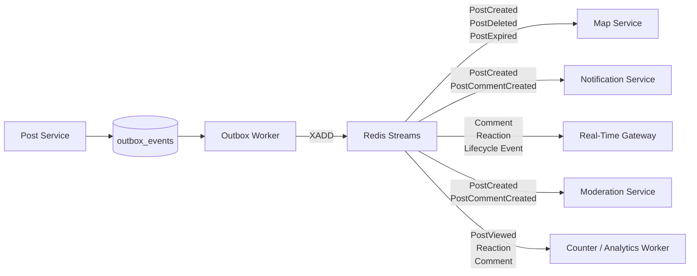

Post Service는 `post:events` Stream에 이벤트를 기록한다. 이벤트 본문에는 `eventId`, `eventType`, `schemaVersion`, `producer`, `correlationId`, `aggregateId`, `occurredAt`, `payload`를 담는다. 위 생산 이벤트 목록 중 실제 후속 처리가 필요한 이벤트만 Consumer가 구독하며, Stream ID는 전송 위치이고 중복 제거 식별자는 `eventId`다. 이벤트 스키마 변경은 하위 호환을 유지하고, 호환되지 않으면 새 버전을 정의한다.

| Consumer Group | 담당 서비스 | 대표 처리 |
| --- | --- | --- |
| `post-map` | Map Service | 공간 인덱스 반영 및 제거 |
| `post-notification` | Notification Service | 알림 대상 산출 및 저장 |
| `post-realtime` | Real-Time Gateway | Redis Pub/Sub 전파 후 각 Gateway instance의 Room에 전달 |
| `post-moderation` | Moderation Service | 게시물과 댓글 검토 |
| `post-analytics` | Counter / Analytics Worker | 조회, 반응, 댓글 집계 |

각 서비스는 독립된 Consumer Group에서 `XREADGROUP`으로 읽는다. 같은 서비스의 Worker들은 그룹 안에서 분담한다. 소유 데이터 변경과 `eventId` 중복 처리 기록을 완료한 뒤 `XACK`한다. 처리 도중 중단된 메시지는 `XPENDING`으로 감시하고 `XAUTOCLAIM`으로 회수한다. 재시도를 제한하며 처리 불가능한 메시지는 오류와 원본 식별 정보를 Dead Letter Stream에 기록한 사실을 확인한 후 원본을 `XACK`한다.

Realtime Consumer Group은 이벤트를 한 Gateway instance에만 전달한다. 해당 instance는 Redis Pub/Sub으로 모든 Gateway instance에 전달한 뒤 각 instance가 자신의 로컬 Room에 Broadcast한다. Redis Pub/Sub은 현재 연결된 클라이언트 전파에만 사용한다. 재연결한 클라이언트는 놓친 영속 상태를 API에서 다시 조회한다.

Stream 보존 기간과 크기는 가장 느린 필수 Consumer의 복구 시간을 기준으로 정하고, Trim 전에 Pending과 Consumer 지연을 감시한다. Redis 장애나 장애 조치로 이미 발행한 이벤트가 유실될 수 있으므로 Redis 지속성 및 복제 설정을 검증하고, Post Service의 MongoDB 원본 상태와 각 소비 서비스의 반영 상태를 대조해 재발행 또는 인덱스 재구축으로 복구한다. 동일 게시판의 상태 변경을 순서대로 적용해야 하는 Consumer는 `aggregateId` 기준 직렬 처리 또는 현재 상태 검증을 수행한다.

---

# PostCreated Event 처리

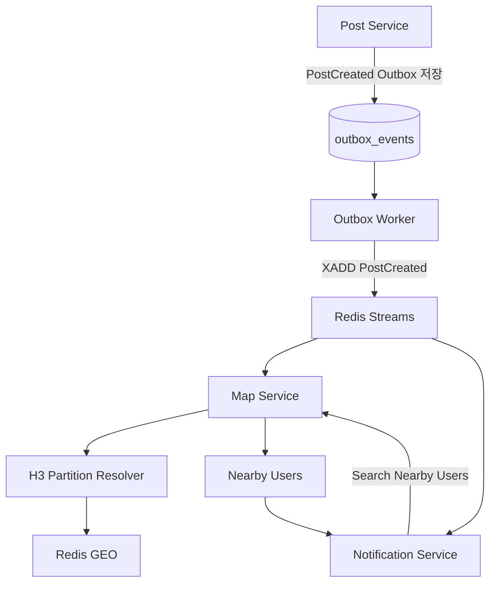

---

# PostExpired Event 처리

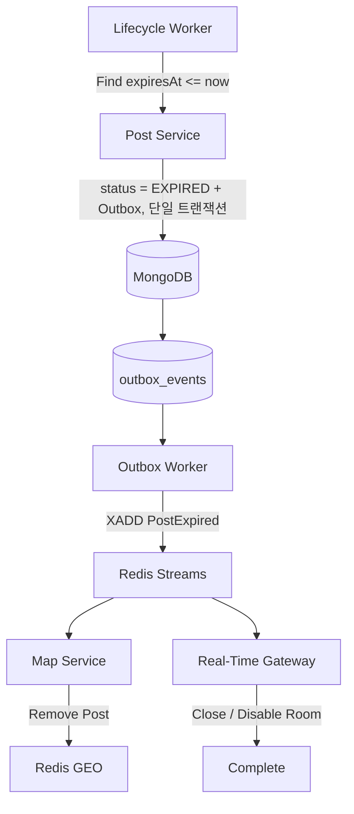

---

# 전체 서비스 책임

Post Service의 책임을 정리하면 다음과 같다.

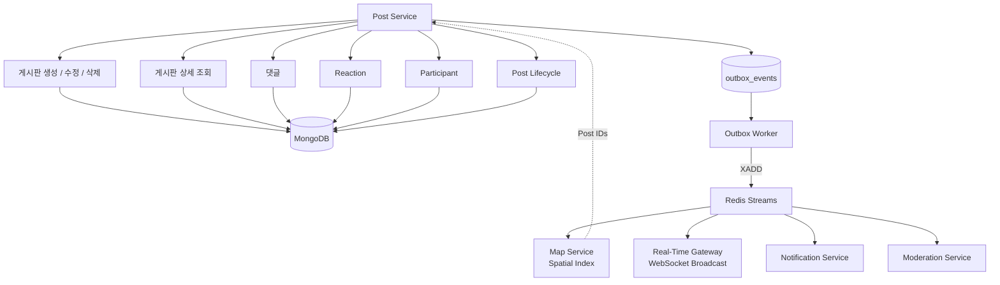

---

# Post Service Architecture 요약

```
Client
   │
   ▼
HTTP Gateway / Real-Time Gateway
   │
   ▼
Post Service
   │
   ├── Post Command
   ├── Post Query
   ├── Comment
   ├── Reaction
   ├── Participant
   └── Lifecycle
   │
   ▼
 MongoDB (도메인 데이터 + Outbox, 단일 트랜잭션)
   │
   ▼
 Outbox Worker
   │ XADD
   ▼
 Redis Streams
   ├── Map Service
   ├── Notification Service
   ├── Moderation Service
   └── Real-Time Gateway → Redis Pub/Sub → 각 Gateway instance
```

---

# 최종 정의

> **Post Service는 게시판의 생성부터 만료까지 게시판 Domain의 상태와 콘텐츠를 관리하는 Source of Truth이다.**
> 
> 
> 게시판의 위치 기반 검색은 Map Service에 위임하고, 실시간 Client 연결은 Real-Time Gateway가 담당한다.
> 
> Post Service에서 발생한 주요 상태 변경은 Redis Streams Event로 다른 Microservice에 전달한다.
> 
> MongoDB에서는 `posts`, `post_comments`, `post_reactions`, `post_participants`를 독립 Collection으로 분리하여 하나의 거대한 Document에 Write가 집중되는 것을 방지한다.
> 

---

# Map Service와 Post Service의 최종 관계

[Mermaid 다이어그램](data:image/svg+xml;utf8,%3Csvg%20id%3D%22chatgpt-mermaid-_r_l9i_%22%20width%3D%22643.4840087890625%22%20xmlns%3D%22http%3A%2F%2Fwww.w3.org%2F2000%2Fsvg%22%20class%3D%22flowchart%22%20height%3D%22456.40252685546875%22%20viewBox%3D%224%203.9999961853027344%20643.4840087890625%20456.40252685546875%22%20role%3D%22graphics-document%20document%22%20aria-roledescription%3D%22flowchart-v2%22%3E%3Cstyle%3E%23chatgpt-mermaid-_r_l9i_%7Bfont-family%3A-apple-system%2C%22system-ui%22%2C%22Segoe%20UI%22%2Csans-serif%3Bfont-size%3A14px%3Bfill%3Argb(26%2C%2028%2C%2031)%3B%7D%40keyframes%20edge-animation-frame%7Bfrom%7Bstroke-dashoffset%3A0%3B%7D%7D%40keyframes%20dash%7Bto%7Bstroke-dashoffset%3A0%3B%7D%7D%23chatgpt-mermaid-_r_l9i_%20.edge-animation-slow%7Bstroke-dasharray%3A9%2C5!important%3Bstroke-dashoffset%3A900%3Banimation%3Adash%2050s%20linear%20infinite%3Bstroke-linecap%3Around%3B%7D%23chatgpt-mermaid-_r_l9i_%20.edge-animation-fast%7Bstroke-dasharray%3A9%2C5!important%3Bstroke-dashoffset%3A900%3Banimation%3Adash%2020s%20linear%20infinite%3Bstroke-linecap%3Around%3B%7D%23chatgpt-mermaid-_r_l9i_%20.error-icon%7Bfill%3Argba(255%2C%20255%2C%20255%2C%200.96)%3B%7D%23chatgpt-mermaid-_r_l9i_%20.error-text%7Bfill%3Argb(26%2C%2028%2C%2031)%3Bstroke%3Argb(26%2C%2028%2C%2031)%3B%7D%23chatgpt-mermaid-_r_l9i_%20.edge-thickness-normal%7Bstroke-width%3A1px%3B%7D%23chatgpt-mermaid-_r_l9i_%20.edge-thickness-thick%7Bstroke-width%3A3.5px%3B%7D%23chatgpt-mermaid-_r_l9i_%20.edge-pattern-solid%7Bstroke-dasharray%3A0%3B%7D%23chatgpt-mermaid-_r_l9i_%20.edge-thickness-invisible%7Bstroke-width%3A0%3Bfill%3Anone%3B%7D%23chatgpt-mermaid-_r_l9i_%20.edge-pattern-dashed%7Bstroke-dasharray%3A3%3B%7D%23chatgpt-mermaid-_r_l9i_%20.edge-pattern-dotted%7Bstroke-dasharray%3A2%3B%7D%23chatgpt-mermaid-_r_l9i_%20.marker%7Bfill%3Argba(26%2C%2028%2C%2031%2C%200.494)%3Bstroke%3Argba(26%2C%2028%2C%2031%2C%200.494)%3B%7D%23chatgpt-mermaid-_r_l9i_%20.marker.cross%7Bstroke%3Argba(26%2C%2028%2C%2031%2C%200.494)%3B%7D%23chatgpt-mermaid-_r_l9i_%20svg%7Bfont-family%3A-apple-system%2C%22system-ui%22%2C%22Segoe%20UI%22%2Csans-serif%3Bfont-size%3A14px%3B%7D%23chatgpt-mermaid-_r_l9i_%20p%7Bmargin%3A0%3B%7D%23chatgpt-mermaid-_r_l9i_%20.label%7Bfont-family%3A-apple-system%2C%22system-ui%22%2C%22Segoe%20UI%22%2Csans-serif%3Bcolor%3Argb(26%2C%2028%2C%2031)%3B%7D%23chatgpt-mermaid-_r_l9i_%20.cluster-label%20text%7Bfill%3Argb(26%2C%2028%2C%2031)%3B%7D%23chatgpt-mermaid-_r_l9i_%20.cluster-label%20span%7Bcolor%3Argb(26%2C%2028%2C%2031)%3B%7D%23chatgpt-mermaid-_r_l9i_%20.cluster-label%20span%20p%7Bbackground-color%3Atransparent%3B%7D%23chatgpt-mermaid-_r_l9i_%20.label%20text%2C%23chatgpt-mermaid-_r_l9i_%20span%7Bfill%3Argb(26%2C%2028%2C%2031)%3Bcolor%3Argb(26%2C%2028%2C%2031)%3B%7D%23chatgpt-mermaid-_r_l9i_%20.node%20rect%2C%23chatgpt-mermaid-_r_l9i_%20.node%20circle%2C%23chatgpt-mermaid-_r_l9i_%20.node%20ellipse%2C%23chatgpt-mermaid-_r_l9i_%20.node%20polygon%2C%23chatgpt-mermaid-_r_l9i_%20.node%20path%7Bfill%3Argb(224%2C%20237%2C%20254)%3Bstroke%3Argb(83%2C%20154%2C%20248)%3Bstroke-width%3A1px%3B%7D%23chatgpt-mermaid-_r_l9i_%20.rough-node%20.label%20text%2C%23chatgpt-mermaid-_r_l9i_%20.node%20.label%20text%2C%23chatgpt-mermaid-_r_l9i_%20.image-shape%20.label%2C%23chatgpt-mermaid-_r_l9i_%20.icon-shape%20.label%7Btext-anchor%3Amiddle%3B%7D%23chatgpt-mermaid-_r_l9i_%20.node%20.katex%20path%7Bfill%3A%23000%3Bstroke%3A%23000%3Bstroke-width%3A1px%3B%7D%23chatgpt-mermaid-_r_l9i_%20.rough-node%20.label%2C%23chatgpt-mermaid-_r_l9i_%20.node%20.label%2C%23chatgpt-mermaid-_r_l9i_%20.image-shape%20.label%2C%23chatgpt-mermaid-_r_l9i_%20.icon-shape%20.label%7Btext-align%3Acenter%3B%7D%23chatgpt-mermaid-_r_l9i_%20.node.clickable%7Bcursor%3Apointer%3B%7D%23chatgpt-mermaid-_r_l9i_%20.root%20.anchor%20path%7Bfill%3Argba(26%2C%2028%2C%2031%2C%200.494)!important%3Bstroke-width%3A0%3Bstroke%3Argba(26%2C%2028%2C%2031%2C%200.494)%3B%7D%23chatgpt-mermaid-_r_l9i_%20.arrowheadPath%7Bfill%3Argba(26%2C%2028%2C%2031%2C%200.494)%3B%7D%23chatgpt-mermaid-_r_l9i_%20.edgePath%20.path%7Bstroke%3Argba(26%2C%2028%2C%2031%2C%200.494)%3Bstroke-width%3A2.0px%3B%7D%23chatgpt-mermaid-_r_l9i_%20.flowchart-link%7Bstroke%3Argba(26%2C%2028%2C%2031%2C%200.494)%3Bfill%3Anone%3B%7D%23chatgpt-mermaid-_r_l9i_%20.edgeLabel%7Bbackground-color%3Argb(255%2C%20255%2C%20255)%3Btext-align%3Acenter%3B%7D%23chatgpt-mermaid-_r_l9i_%20.edgeLabel%20p%7Bbackground-color%3Argb(255%2C%20255%2C%20255)%3B%7D%23chatgpt-mermaid-_r_l9i_%20.edgeLabel%20rect%7Bopacity%3A0.5%3Bbackground-color%3Argb(255%2C%20255%2C%20255)%3Bfill%3Argb(255%2C%20255%2C%20255)%3B%7D%23chatgpt-mermaid-_r_l9i_%20.labelBkg%7Bbackground-color%3Argba(255%2C%20255%2C%20255%2C%200.5)%3B%7D%23chatgpt-mermaid-_r_l9i_%20.cluster%20rect%7Bfill%3Argba(255%2C%20255%2C%20255%2C%200.96)%3Bstroke%3Argba(26%2C%2028%2C%2031%2C%200.08)%3Bstroke-width%3A1px%3B%7D%23chatgpt-mermaid-_r_l9i_%20.cluster%20text%7Bfill%3Argb(26%2C%2028%2C%2031)%3B%7D%23chatgpt-mermaid-_r_l9i_%20.cluster%20span%7Bcolor%3Argb(26%2C%2028%2C%2031)%3B%7D%23chatgpt-mermaid-_r_l9i_%20div.mermaidTooltip%7Bposition%3Aabsolute%3Btext-align%3Acenter%3Bmax-width%3A200px%3Bpadding%3A2px%3Bfont-family%3A-apple-system%2C%22system-ui%22%2C%22Segoe%20UI%22%2Csans-serif%3Bfont-size%3A12px%3Bbackground%3Argba(255%2C%20255%2C%20255%2C%200.96)%3Bborder%3A1px%20solid%20rgba(26%2C%2028%2C%2031%2C%200.08)%3Bborder-radius%3A2px%3Bpointer-events%3Anone%3Bz-index%3A100%3B%7D%23chatgpt-mermaid-_r_l9i_%20.flowchartTitleText%7Btext-anchor%3Amiddle%3Bfont-size%3A18px%3Bfill%3Argb(26%2C%2028%2C%2031)%3B%7D%23chatgpt-mermaid-_r_l9i_%20rect.text%7Bfill%3Anone%3Bstroke-width%3A0%3B%7D%23chatgpt-mermaid-_r_l9i_%20.icon-shape%2C%23chatgpt-mermaid-_r_l9i_%20.image-shape%7Bbackground-color%3Argb(255%2C%20255%2C%20255)%3Btext-align%3Acenter%3B%7D%23chatgpt-mermaid-_r_l9i_%20.icon-shape%20p%2C%23chatgpt-mermaid-_r_l9i_%20.image-shape%20p%7Bbackground-color%3Argb(255%2C%20255%2C%20255)%3Bpadding%3A2px%3B%7D%23chatgpt-mermaid-_r_l9i_%20.icon-shape%20rect%2C%23chatgpt-mermaid-_r_l9i_%20.image-shape%20rect%7Bopacity%3A0.5%3Bbackground-color%3Argb(255%2C%20255%2C%20255)%3Bfill%3Argb(255%2C%20255%2C%20255)%3B%7D%23chatgpt-mermaid-_r_l9i_%20.label-icon%7Bdisplay%3Ainline-block%3Bheight%3A1em%3Boverflow%3Avisible%3Bvertical-align%3A-0.125em%3B%7D%23chatgpt-mermaid-_r_l9i_%20.node%20.label-icon%20path%7Bfill%3AcurrentColor%3Bstroke%3Arevert%3Bstroke-width%3Arevert%3B%7D%23chatgpt-mermaid-_r_l9i_%20.node%20text%7Bfont-size%3A16px%3Bfont-weight%3A600%3Bletter-spacing%3A-0.32px%3Bfill%3A%23004f99%3B%7D%23chatgpt-mermaid-_r_l9i_%20.edgeLabels%20text%7Bfont-size%3A13px%3Bfont-weight%3A600%3Bletter-spacing%3A-0.08px%3Bfill%3A%23004f99%3B%7D%23chatgpt-mermaid-_r_l9i_%20.node%20tspan%5Bfont-weight%3D%22normal%22%5D%2C%23chatgpt-mermaid-_r_l9i_%20.edgeLabels%20tspan%5Bfont-weight%3D%22normal%22%5D%7Bfont-weight%3A600%3B%7D%23chatgpt-mermaid-_r_l9i_%20.edgeLabel%20.label%20rect%7Bopacity%3A1%3Brx%3A13px%3Bry%3A13px%3Bfill%3A%23f5faff%3Bstroke%3Argb(206%2C%20219%2C%20229)%3Bstroke-width%3A1px%3B%7D%23chatgpt-mermaid-_r_l9i_%20.node%20rect%2C%23chatgpt-mermaid-_r_l9i_%20.node%20circle%2C%23chatgpt-mermaid-_r_l9i_%20.node%20ellipse%2C%23chatgpt-mermaid-_r_l9i_%20.node%20polygon%2C%23chatgpt-mermaid-_r_l9i_%20.node%20path%7Bfill%3Argb(229%2C%20243%2C%20255)%3Bstroke%3Argba(0%2C%200%2C%200%2C%200.1)%3Bstroke-width%3A1px%3B%7D%23chatgpt-mermaid-_r_l9i_%20.node%20rect%7Brx%3A16px%3Bry%3A16px%3B%7D%23chatgpt-mermaid-_r_l9i_%20.node.mermaid-decision%20.label-container%7Bfill%3A%23f5faff%3Bstroke%3Argb(206%2C%20219%2C%20229)%3Bstroke-dasharray%3A2%202%3B%7D%23chatgpt-mermaid-_r_l9i_%20.edgePaths%20.flowchart-link%7Bstroke%3Argb(206%2C%20219%2C%20229)%3Bstroke-width%3A1px%3Bstroke-linecap%3Around%3Bstroke-linejoin%3Around%3B%7D%23chatgpt-mermaid-_r_l9i_%20.marker%7Bfill%3Argb(206%2C%20219%2C%20229)%3Bstroke%3Argb(206%2C%20219%2C%20229)%3B%7D%23chatgpt-mermaid-_r_l9i_%20.node%7Bcolor-scheme%3Alight%3B%7D%23chatgpt-mermaid-_r_l9i_%20%3Aroot%7B--mermaid-font-family%3A-apple-system%2C%22system-ui%22%2C%22Segoe%20UI%22%2Csans-serif%3B%7D%3C%2Fstyle%3E%3Cg%3E%3Cmarker%20id%3D%22chatgpt-mermaid-_r_l9i__flowchart-v2-pointEnd%22%20class%3D%22marker%20flowchart-v2%22%20viewBox%3D%22-5%20-5%2010%2010%22%20refX%3D%220%22%20refY%3D%220%22%20markerUnits%3D%22userSpaceOnUse%22%20markerWidth%3D%2210%22%20markerHeight%3D%2210%22%20orient%3D%22auto%22%3E%3Cpath%20d%3D%22M%200%200%20L%204%200%20M%200.8180194846605362%20-3.181980515339464%20L%204%200%20L%200.8180194846605362%203.181980515339464%22%20class%3D%22arrowMarkerPath%22%20style%3D%22stroke-width%3A%201%3B%20stroke-dasharray%3A%20none%3B%20fill%3A%20none%3B%20stroke-linecap%3A%20round%3B%20stroke-linejoin%3A%20round%3B%22%3E%3C%2Fpath%3E%3C%2Fmarker%3E%3Cmarker%20id%3D%22chatgpt-mermaid-_r_l9i__flowchart-v2-pointStart%22%20class%3D%22marker%20flowchart-v2%22%20viewBox%3D%22-5%20-5%2010%2010%22%20refX%3D%220%22%20refY%3D%220%22%20markerUnits%3D%22userSpaceOnUse%22%20markerWidth%3D%2210%22%20markerHeight%3D%2210%22%20orient%3D%22auto%22%3E%3Cpath%20d%3D%22M%200%200%20L%20-4%200%20M%20-0.8180194846605362%20-3.181980515339464%20L%20-4%200%20L%20-0.8180194846605362%203.181980515339464%22%20class%3D%22arrowMarkerPath%22%20style%3D%22stroke-width%3A%201%3B%20stroke-dasharray%3A%20none%3B%20fill%3A%20none%3B%20stroke-linecap%3A%20round%3B%20stroke-linejoin%3A%20round%3B%22%3E%3C%2Fpath%3E%3C%2Fmarker%3E%3Cmarker%20id%3D%22chatgpt-mermaid-_r_l9i__flowchart-v2-circleEnd%22%20class%3D%22marker%20flowchart-v2%22%20viewBox%3D%220%200%2010%2010%22%20refX%3D%2211%22%20refY%3D%225%22%20markerUnits%3D%22userSpaceOnUse%22%20markerWidth%3D%2211%22%20markerHeight%3D%2211%22%20orient%3D%22auto%22%3E%3Ccircle%20cx%3D%225%22%20cy%3D%225%22%20r%3D%225%22%20class%3D%22arrowMarkerPath%22%20style%3D%22stroke-width%3A%201%3B%20stroke-dasharray%3A%201%2C%200%3B%22%3E%3C%2Fcircle%3E%3C%2Fmarker%3E%3Cmarker%20id%3D%22chatgpt-mermaid-_r_l9i__flowchart-v2-circleStart%22%20class%3D%22marker%20flowchart-v2%22%20viewBox%3D%220%200%2010%2010%22%20refX%3D%22-1%22%20refY%3D%225%22%20markerUnits%3D%22userSpaceOnUse%22%20markerWidth%3D%2211%22%20markerHeight%3D%2211%22%20orient%3D%22auto%22%3E%3Ccircle%20cx%3D%225%22%20cy%3D%225%22%20r%3D%225%22%20class%3D%22arrowMarkerPath%22%20style%3D%22stroke-width%3A%201%3B%20stroke-dasharray%3A%201%2C%200%3B%22%3E%3C%2Fcircle%3E%3C%2Fmarker%3E%3Cmarker%20id%3D%22chatgpt-mermaid-_r_l9i__flowchart-v2-crossEnd%22%20class%3D%22marker%20cross%20flowchart-v2%22%20viewBox%3D%220%200%2011%2011%22%20refX%3D%2212%22%20refY%3D%225.2%22%20markerUnits%3D%22userSpaceOnUse%22%20markerWidth%3D%2211%22%20markerHeight%3D%2211%22%20orient%3D%22auto%22%3E%3Cpath%20d%3D%22M%201%2C1%20l%209%2C9%20M%2010%2C1%20l%20-9%2C9%22%20class%3D%22arrowMarkerPath%22%20style%3D%22stroke-width%3A%202%3B%20stroke-dasharray%3A%201%2C%200%3B%22%3E%3C%2Fpath%3E%3C%2Fmarker%3E%3Cmarker%20id%3D%22chatgpt-mermaid-_r_l9i__flowchart-v2-crossStart%22%20class%3D%22marker%20cross%20flowchart-v2%22%20viewBox%3D%220%200%2011%2011%22%20refX%3D%22-1%22%20refY%3D%225.2%22%20markerUnits%3D%22userSpaceOnUse%22%20markerWidth%3D%2211%22%20markerHeight%3D%2211%22%20orient%3D%22auto%22%3E%3Cpath%20d%3D%22M%201%2C1%20l%209%2C9%20M%2010%2C1%20l%20-9%2C9%22%20class%3D%22arrowMarkerPath%22%20style%3D%22stroke-width%3A%202%3B%20stroke-dasharray%3A%201%2C%200%3B%22%3E%3C%2Fpath%3E%3C%2Fmarker%3E%3C%2Fg%3E%3Cg%20class%3D%22subgraphs%22%3E%3C%2Fg%3E%3Cg%20class%3D%22nodes%22%3E%3Cg%20class%3D%22node%20default%22%20id%3D%22flowchart-CLIENT-0%22%20transform%3D%22translate(321.671875%2C%20138.6337178548177)%22%3E%3Crect%20class%3D%22basic%20label-container%22%20style%3D%22%22%20x%3D%22-57.203125%22%20y%3D%22-30%22%20width%3D%22114.40625%22%20height%3D%2260%22%3E%3C%2Frect%3E%3Cg%20class%3D%22label%22%20style%3D%22%22%20transform%3D%22translate(0%2C%20-9)%22%3E%3Crect%3E%3C%2Frect%3E%3Cg%3E%3Crect%20class%3D%22background%22%20style%3D%22stroke%3A%20none%22%3E%3C%2Frect%3E%3Ctext%20y%3D%22-10.1%22%20style%3D%22%22%3E%3Ctspan%20class%3D%22text-outer-tspan%22%20x%3D%220%22%20y%3D%22-0.1em%22%20dy%3D%221.1em%22%3E%3Ctspan%20font-style%3D%22normal%22%20class%3D%22text-inner-tspan%22%20font-weight%3D%22normal%22%3EClient%3C%2Ftspan%3E%3C%2Ftspan%3E%3C%2Ftext%3E%3C%2Fg%3E%3C%2Fg%3E%3C%2Fg%3E%3Cg%20class%3D%22node%20default%22%20id%3D%22flowchart-G-1%22%20transform%3D%22translate(549.1795120239258%2C%20264.8480035691034)%22%3E%3Crect%20class%3D%22basic%20label-container%22%20style%3D%22%22%20x%3D%22-90.30451202392578%22%20y%3D%22-30%22%20width%3D%22180.60902404785156%22%20height%3D%2260%22%3E%3C%2Frect%3E%3Cg%20class%3D%22label%22%20style%3D%22%22%20transform%3D%22translate(0%2C%20-9.00262451171875)%22%3E%3Crect%3E%3C%2Frect%3E%3Cg%3E%3Crect%20class%3D%22background%22%20style%3D%22stroke%3A%20none%22%3E%3C%2Frect%3E%3Ctext%20y%3D%22-10.1%22%20style%3D%22%22%3E%3Ctspan%20class%3D%22text-outer-tspan%22%20x%3D%220%22%20y%3D%22-0.1em%22%20dy%3D%221.1em%22%3E%3Ctspan%20font-style%3D%22normal%22%20class%3D%22text-inner-tspan%22%20font-weight%3D%22normal%22%3EHTTP%3C%2Ftspan%3E%3Ctspan%20font-style%3D%22normal%22%20class%3D%22text-inner-tspan%22%20font-weight%3D%22normal%22%3E%20Gateway%3C%2Ftspan%3E%3C%2Ftspan%3E%3C%2Ftext%3E%3C%2Fg%3E%3C%2Fg%3E%3C%2Fg%3E%3Cg%20class%3D%22node%20default%22%20id%3D%22flowchart-MAP-2%22%20transform%3D%22translate(93.8984375%2C%20248.85371831258135)%22%3E%3Crect%20class%3D%22basic%20label-container%22%20style%3D%22%22%20x%3D%22-81.0390625%22%20y%3D%22-33.79999923706055%22%20width%3D%22162.078125%22%20height%3D%2267.5999984741211%22%3E%3C%2Frect%3E%3Cg%20class%3D%22label%22%20style%3D%22%22%20transform%3D%22translate(0%2C%20-17.799999237060547)%22%3E%3Crect%3E%3C%2Frect%3E%3Cg%3E%3Crect%20class%3D%22background%22%20style%3D%22stroke%3A%20none%22%3E%3C%2Frect%3E%3Ctext%20y%3D%22-10.1%22%20style%3D%22%22%3E%3Ctspan%20class%3D%22text-outer-tspan%22%20x%3D%220%22%20y%3D%22-0.1em%22%20dy%3D%221.1em%22%3E%3Ctspan%20font-style%3D%22normal%22%20class%3D%22text-inner-tspan%22%20font-weight%3D%22normal%22%3EMap%3C%2Ftspan%3E%3Ctspan%20font-style%3D%22normal%22%20class%3D%22text-inner-tspan%22%20font-weight%3D%22normal%22%3E%20Service%3C%2Ftspan%3E%3C%2Ftspan%3E%3Ctspan%20class%3D%22text-outer-tspan%22%20x%3D%220%22%20y%3D%221em%22%20dy%3D%221.1em%22%3E%3Ctspan%20font-style%3D%22normal%22%20class%3D%22text-inner-tspan%22%20font-weight%3D%22normal%22%3EWhere%3F%3C%2Ftspan%3E%3C%2Ftspan%3E%3C%2Ftext%3E%3C%2Fg%3E%3C%2Fg%3E%3C%2Fg%3E%3Cg%20class%3D%22node%20default%22%20id%3D%22flowchart-POST-3%22%20transform%3D%22translate(93.46875%2C%20410.85371831258135)%22%3E%3Crect%20class%3D%22basic%20label-container%22%20style%3D%22%22%20x%3D%22-81.46875%22%20y%3D%22-33.79999923706055%22%20width%3D%22162.9375%22%20height%3D%2267.5999984741211%22%3E%3C%2Frect%3E%3Cg%20class%3D%22label%22%20style%3D%22%22%20transform%3D%22translate(0%2C%20-17.799999237060547)%22%3E%3Crect%3E%3C%2Frect%3E%3Cg%3E%3Crect%20class%3D%22background%22%20style%3D%22stroke%3A%20none%22%3E%3C%2Frect%3E%3Ctext%20y%3D%22-10.1%22%20style%3D%22%22%3E%3Ctspan%20class%3D%22text-outer-tspan%22%20x%3D%220%22%20y%3D%22-0.1em%22%20dy%3D%221.1em%22%3E%3Ctspan%20font-style%3D%22normal%22%20class%3D%22text-inner-tspan%22%20font-weight%3D%22normal%22%3EPost%3C%2Ftspan%3E%3Ctspan%20font-style%3D%22normal%22%20class%3D%22text-inner-tspan%22%20font-weight%3D%22normal%22%3E%20Service%3C%2Ftspan%3E%3C%2Ftspan%3E%3Ctspan%20class%3D%22text-outer-tspan%22%20x%3D%220%22%20y%3D%221em%22%20dy%3D%221.1em%22%3E%3Ctspan%20font-style%3D%22normal%22%20class%3D%22text-inner-tspan%22%20font-weight%3D%22normal%22%3EWhat%3F%3C%2Ftspan%3E%3C%2Ftspan%3E%3C%2Ftext%3E%3C%2Fg%3E%3C%2Fg%3E%3C%2Fg%3E%3Cg%20class%3D%22node%20default%22%20id%3D%22flowchart-REDIS-4%22%20transform%3D%22translate(504.6328125%2C%2044.35028839111328)%22%3E%3Cpath%20d%3D%22M0%2C10.566861514036228%20a45.7578125%2C10.566861514036228%200%2C0%2C0%2091.515625%2C0%20a45.7578125%2C10.566861514036228%200%2C0%2C0%20-91.515625%2C0%20l0%2C43.566861514036226%20a45.7578125%2C10.566861514036228%200%2C0%2C0%2091.515625%2C0%20l0%2C-43.566861514036226%22%20class%3D%22basic%20label-container%22%20style%3D%22%22%20transform%3D%22translate(-45.7578125%2C%20-32.35029227105434)%22%3E%3C%2Fpath%3E%3Cg%20class%3D%22label%22%20style%3D%22%22%20transform%3D%22translate(0%2C%200)%22%3E%3Crect%3E%3C%2Frect%3E%3Cg%3E%3Crect%20class%3D%22background%22%20style%3D%22stroke%3A%20none%22%3E%3C%2Frect%3E%3Ctext%20y%3D%22-10.1%22%20style%3D%22%22%3E%3Ctspan%20class%3D%22text-outer-tspan%22%20x%3D%220%22%20y%3D%22-0.1em%22%20dy%3D%221.1em%22%3E%3Ctspan%20font-style%3D%22normal%22%20class%3D%22text-inner-tspan%22%20font-weight%3D%22normal%22%3ERedis%3C%2Ftspan%3E%3Ctspan%20font-style%3D%22normal%22%20class%3D%22text-inner-tspan%22%20font-weight%3D%22normal%22%3E%20GEO%3C%2Ftspan%3E%3C%2Ftspan%3E%3C%2Ftext%3E%3C%2Fg%3E%3C%2Fg%3E%3C%2Fg%3E%3Cg%20class%3D%22node%20default%22%20id%3D%22flowchart-MONGO-5%22%20transform%3D%22translate(502.4296875%2C%20420.4993254343668)%22%3E%3Cpath%20d%3D%22M0%2C10.267034990791897%20a43.5546875%2C10.267034990791897%200%2C0%2C0%2087.109375%2C0%20a43.5546875%2C10.267034990791897%200%2C0%2C0%20-87.109375%2C0%20l0%2C43.2722840142294%20a43.5546875%2C10.267034990791897%200%2C0%2C0%2087.109375%2C0%20l0%2C-43.2722840142294%22%20class%3D%22basic%20label-container%22%20style%3D%22%22%20transform%3D%22translate(-43.5546875%2C%20-31.9031769979066)%22%3E%3C%2Fpath%3E%3Cg%20class%3D%22label%22%20style%3D%22%22%20transform%3D%22translate(0%2C%20-0.00262451171875)%22%3E%3Crect%3E%3C%2Frect%3E%3Cg%3E%3Crect%20class%3D%22background%22%20style%3D%22stroke%3A%20none%22%3E%3C%2Frect%3E%3Ctext%20y%3D%22-10.1%22%20style%3D%22%22%3E%3Ctspan%20class%3D%22text-outer-tspan%22%20x%3D%220%22%20y%3D%22-0.1em%22%20dy%3D%221.1em%22%3E%3Ctspan%20font-style%3D%22normal%22%20class%3D%22text-inner-tspan%22%20font-weight%3D%22normal%22%3EMongoDB%3C%2Ftspan%3E%3C%2Ftspan%3E%3C%2Ftext%3E%3C%2Fg%3E%3C%2Fg%3E%3C%2Fg%3E%3C%2Fg%3E%3Cg%20class%3D%22edges%20edgePaths%22%3E%3Cpath%20d%3D%22M378.875%2C128.6337178548177L432.09204397470535%2C128.6337178548177Q433.875%2C128.6337178548177%20435.2892135623731%2C129.71950429244458L435.2892135623731%2C129.7195042924446Q436.7034271247462%2C130.8052907300715%20437.7892135623731%2C132.21950429244458L437.7892135623731%2C132.21950429244458Q438.875%2C133.6337178548177%20438.875%2C135.41667388011234L438.875%2C236.63647611523731Q438.875%2C238.41943214053197%20439.9607864376269%2C239.83364570290507L439.9607864376269%2C239.83364570290507Q441.0465728752538%2C241.24785926527815%20442.4607864376269%2C242.33364570290505L442.4607864376269%2C242.33364570290507Q443.875%2C243.41943214053197%20445.65795602529465%2C243.41943214053197L448.875%2C243.41943214053197%22%20id%3D%22L_CLIENT_G_0%22%20class%3D%22edge-thickness-normal%20edge-pattern-solid%20edge-thickness-normal%20edge-pattern-solid%20flowchart-link%22%20style%3D%22%3B%22%20data-edge%3D%22true%22%20data-et%3D%22edge%22%20data-id%3D%22L_CLIENT_G_0%22%20data-points%3D%22W3sieCI6Mzc4Ljg3NSwieSI6MTI4LjYzMzcxNzg1NDgxNzd9LHsieCI6NDM4Ljg3NSwieSI6MTI4LjYzMzcxNzg1NDgxNzd9LHsieCI6NDM4Ljg3NSwieSI6MjQzLjQxOTQzMjE0MDUzMTk3fSx7IngiOjQ1Mi44NzUsInkiOjI0My40MTk0MzIxNDA1MzE5N31d%22%20marker-end%3D%22url(%23chatgpt-mermaid-_r_l9i__flowchart-v2-pointEnd)%22%3E%3C%2Fpath%3E%3Cpath%20d%3D%22M458.875%2C269.13371785481763L186.9375%2C269.1337178548177%22%20id%3D%22L_G_MAP_0%22%20class%3D%22edge-thickness-normal%20edge-pattern-solid%20edge-thickness-normal%20edge-pattern-solid%20flowchart-link%22%20style%3D%22%3B%22%20data-edge%3D%22true%22%20data-et%3D%22edge%22%20data-id%3D%22L_G_MAP_0%22%20data-points%3D%22W3sieCI6NDU4Ljg3NSwieSI6MjY5LjEzMzcxNzg1NDgxNzYzfSx7IngiOjE4Mi45Mzc1LCJ5IjoyNjkuMTMzNzE3ODU0ODE3N31d%22%20marker-end%3D%22url(%23chatgpt-mermaid-_r_l9i__flowchart-v2-pointEnd)%22%3E%3C%2Fpath%3E%3Cpath%20d%3D%22M174.9375%2C228.573718770345L188.15454397470535%2C228.573718770345Q189.9375%2C228.573718770345%20191.3517135623731%2C227.48793233271812L191.3517135623731%2C227.48793233271812Q192.76592712474618%2C226.4021458950912%20193.8517135623731%2C224.98793233271812L193.8517135623731%2C224.98793233271812Q194.9375%2C223.573718770345%20194.9375%2C221.79076274505036L194.9375%2C27.41667388011235Q194.9375%2C25.63371785481769%20196.0232864376269%2C24.219504292444594L196.02328643762692%2C24.21950429244459Q197.10907287525382%2C22.805290730071498%20198.5232864376269%2C21.719504292444594L198.5232864376269%2C21.719504292444594Q199.9375%2C20.63371785481769%20201.72045602529465%2C20.63371785481769L316.90625%2C20.63371785481769L392.09204397470535%2C20.63371785481769Q393.875%2C20.63371785481769%20395.2892135623731%2C21.719504292444594L395.2892135623731%2C21.719504292444604Q396.7034271247462%2C22.805290730071498%20397.7892135623731%2C24.219504292444594L397.9818863305982%2C24.470456443329287Q398.875%2C25.63371785481769%20398.875%2C27.10028839111328L398.875%2C27.10028839111328Q398.875%2C28.566858927408873%20399.7681136694018%2C29.730120338897276L399.9607864376269%2C29.98107248978197Q401.0465728752538%2C31.395286052155065%20402.4607864376269%2C32.48107248978196L402.4607864376269%2C32.481072489781965Q403.875%2C33.56685892740887%20405.65795602529465%2C33.56685892740887L446.875%2C33.56685892740887%22%20id%3D%22L_MAP_REDIS_0%22%20class%3D%22edge-thickness-normal%20edge-pattern-solid%20edge-thickness-normal%20edge-pattern-solid%20flowchart-link%22%20style%3D%22%3B%22%20data-edge%3D%22true%22%20data-et%3D%22edge%22%20data-id%3D%22L_MAP_REDIS_0%22%20data-points%3D%22W3sieCI6MTc0LjkzNzUsInkiOjIyOC41NzM3MTg3NzAzNDV9LHsieCI6MTk0LjkzNzUsInkiOjIyOC41NzM3MTg3NzAzNDV9LHsieCI6MTk0LjkzNzUsInkiOjIwLjYzMzcxNzg1NDgxNzY5fSx7IngiOjMxNi45MDYyNSwieSI6MjAuNjMzNzE3ODU0ODE3Njl9LHsieCI6Mzk4Ljg3NSwieSI6MjAuNjMzNzE3ODU0ODE3Njl9LHsieCI6Mzk4Ljg3NSwieSI6MzMuNTY2ODU4OTI3NDA4ODd9LHsieCI6NDUwLjg3NSwieSI6MzMuNTY2ODU4OTI3NDA4ODd9XQ%3D%3D%22%20marker-end%3D%22url(%23chatgpt-mermaid-_r_l9i__flowchart-v2-pointEnd)%22%3E%3C%2Fpath%3E%3Cpath%20d%3D%22M458.875%2C55.13371785481769L221.72045602529465%2C55.13371785481769Q219.9375%2C55.13371785481769%20218.5232864376269%2C56.2195042924446L218.5232864376269%2C56.2195042924446Q217.10907287525382%2C57.3052907300715%20216.02328643762692%2C58.71950429244459L216.0232864376269%2C58.7195042924446Q214.9375%2C60.13371785481769%20214.9375%2C61.91667388011235L214.9375%2C235.3107624398746Q214.9375%2C237.09371846516925%20213.8517135623731%2C238.50793202754232L213.8517135623731%2C238.50793202754232Q212.76592712474618%2C239.92214558991543%20211.3517135623731%2C241.00793202754232L211.3517135623731%2C241.00793202754232Q209.9375%2C242.09371846516925%20208.15454397470535%2C242.09371846516925L186.9375%2C242.09371846516925%22%20id%3D%22L_REDIS_MAP_0%22%20class%3D%22edge-thickness-normal%20edge-pattern-solid%20edge-thickness-normal%20edge-pattern-solid%20flowchart-link%22%20style%3D%22%3B%22%20data-edge%3D%22true%22%20data-et%3D%22edge%22%20data-id%3D%22L_REDIS_MAP_0%22%20data-points%3D%22W3sieCI6NDU4Ljg3NSwieSI6NTUuMTMzNzE3ODU0ODE3Njl9LHsieCI6MjE0LjkzNzUsInkiOjU1LjEzMzcxNzg1NDgxNzY5fSx7IngiOjIxNC45Mzc1LCJ5IjoyNDIuMDkzNzE4NDY1MTY5MjV9LHsieCI6MTgyLjkzNzUsInkiOjI0Mi4wOTM3MTg0NjUxNjkyNX1d%22%20marker-end%3D%22url(%23chatgpt-mermaid-_r_l9i__flowchart-v2-pointEnd)%22%3E%3C%2Fpath%3E%3Cpath%20d%3D%22M174.9375%2C255.61371815999345L228.15454397470535%2C255.61371815999345Q229.9375%2C255.61371815999345%20231.3517135623731%2C254.52793172236653L231.3517135623731%2C254.52793172236653Q232.76592712474618%2C253.44214528473964%20233.8517135623731%2C252.02793172236653L233.8517135623731%2C252.02793172236653Q234.9375%2C250.61371815999345%20234.9375%2C248.8307621346988L234.9375%2C228.91667388011234Q234.9375%2C227.1337178548177%20236.0232864376269%2C225.71950429244458L236.0232864376269%2C225.71950429244458Q237.10907287525382%2C224.3052907300715%20238.5232864376269%2C223.21950429244458L238.5232864376269%2C223.21950429244458Q239.9375%2C222.1337178548177%20241.72045602529465%2C222.1337178548177L392.09204397470535%2C222.1337178548177Q393.875%2C222.1337178548177%20395.2892135623731%2C223.21950429244458L395.2892135623731%2C223.2195042924446Q396.7034271247462%2C224.3052907300715%20397.7892135623731%2C225.71950429244458L397.7892135623731%2C225.71950429244458Q398.875%2C227.1337178548177%20398.875%2C228.91667388011234L398.875%2C253.77933325809443Q398.875%2C255.56228928338908%20399.9607864376269%2C256.9765028457622L399.9607864376269%2C256.9765028457622Q401.0465728752538%2C258.3907164081353%20402.4607864376269%2C259.4765028457622L402.4607864376269%2C259.4765028457622Q403.875%2C260.5622892833891%20405.65795602529465%2C260.5622892833891L446.875%2C260.5622892833891%22%20id%3D%22L_MAP_G_0%22%20class%3D%22edge-thickness-normal%20edge-pattern-solid%20edge-thickness-normal%20edge-pattern-solid%20flowchart-link%22%20style%3D%22%3B%22%20data-edge%3D%22true%22%20data-et%3D%22edge%22%20data-id%3D%22L_MAP_G_0%22%20data-points%3D%22W3sieCI6MTc0LjkzNzUsInkiOjI1NS42MTM3MTgxNTk5OTM0NX0seyJ4IjoyMzQuOTM3NSwieSI6MjU1LjYxMzcxODE1OTk5MzQ1fSx7IngiOjIzNC45Mzc1LCJ5IjoyMjIuMTMzNzE3ODU0ODE3N30seyJ4IjozOTguODc1LCJ5IjoyMjIuMTMzNzE3ODU0ODE3N30seyJ4IjozOTguODc1LCJ5IjoyNjAuNTYyMjg5MjgzMzg5MX0seyJ4Ijo0NTAuODc1LCJ5IjoyNjAuNTYyMjg5MjgzMzg5MX1d%22%20marker-end%3D%22url(%23chatgpt-mermaid-_r_l9i__flowchart-v2-pointEnd)%22%3E%3C%2Fpath%3E%3Cpath%20d%3D%22M458.875%2C286.2765749976748L425.65795602529465%2C286.2765749976748Q423.875%2C286.2765749976748%20422.4607864376269%2C287.3623614353017L422.4607864376269%2C287.3623614353017Q421.0465728752538%2C288.4481478729286%20419.9607864376269%2C289.8623614353017L419.9607864376269%2C289.8623614353017Q418.875%2C291.2765749976748%20418.875%2C293.05953102296945L418.875%2C356.35076182952304Q418.875%2C358.1337178548177%20417.7892135623731%2C359.5479314171908L417.7892135623731%2C359.5479314171908Q416.7034271247462%2C360.9621449795639%20415.2892135623731%2C362.0479314171908L415.2892135623731%2C362.0479314171908Q413.875%2C363.1337178548177%20412.09204397470535%2C363.1337178548177L221.72045602529465%2C363.1337178548177Q219.9375%2C363.1337178548177%20218.5232864376269%2C364.2195042924446L218.5232864376269%2C364.2195042924446Q217.10907287525382%2C365.3052907300715%20216.02328643762692%2C366.7195042924446L216.0232864376269%2C366.7195042924446Q214.9375%2C368.1337178548177%20214.9375%2C369.91667388011234L214.9375%2C397.31076243987457Q214.9375%2C399.0937184651692%20213.8517135623731%2C400.5079320275423L213.85171356237308%2C400.5079320275423Q212.76592712474618%2C401.92214558991543%20211.3517135623731%2C403.0079320275423L211.3517135623731%2C403.0079320275423Q209.9375%2C404.0937184651692%20208.15454397470535%2C404.0937184651692L186.9375%2C404.0937184651692%22%20id%3D%22L_G_POST_0%22%20class%3D%22edge-thickness-normal%20edge-pattern-solid%20edge-thickness-normal%20edge-pattern-solid%20flowchart-link%22%20style%3D%22%3B%22%20data-edge%3D%22true%22%20data-et%3D%22edge%22%20data-id%3D%22L_G_POST_0%22%20data-points%3D%22W3sieCI6NDU4Ljg3NSwieSI6Mjg2LjI3NjU3NDk5NzY3NDh9LHsieCI6NDE4Ljg3NSwieSI6Mjg2LjI3NjU3NDk5NzY3NDh9LHsieCI6NDE4Ljg3NSwieSI6MzYzLjEzMzcxNzg1NDgxNzd9LHsieCI6MjE0LjkzNzUsInkiOjM2My4xMzM3MTc4NTQ4MTc3fSx7IngiOjIxNC45Mzc1LCJ5Ijo0MDQuMDkzNzE4NDY1MTY5Mn0seyJ4IjoxODIuOTM3NSwieSI6NDA0LjA5MzcxODQ2NTE2OTJ9XQ%3D%3D%22%20marker-end%3D%22url(%23chatgpt-mermaid-_r_l9i__flowchart-v2-pointEnd)%22%3E%3C%2Fpath%3E%3Cpath%20d%3D%22M174.9375%2C417.6137181599935L228.15454397470535%2C417.6137181599935Q229.9375%2C417.6137181599935%20231.3517135623731%2C416.5279317223666L231.3517135623731%2C416.5279317223666Q232.76592712474618%2C415.4421452847397%20233.85171356237308%2C414.0279317223666L233.8517135623731%2C414.0279317223666Q234.9375%2C412.6137181599935%20234.9375%2C410.83076213469883L234.9375%2C403.41667388011234Q234.9375%2C401.6337178548177%20236.0232864376269%2C400.2195042924446L236.02328643762692%2C400.2195042924446Q237.10907287525382%2C398.8052907300715%20238.5232864376269%2C397.7195042924446L238.5232864376269%2C397.7195042924446Q239.9375%2C396.6337178548177%20241.72045602529465%2C396.6337178548177L316.90625%2C396.6337178548177L392.09204397470535%2C396.6337178548177Q393.875%2C396.6337178548177%20395.2892135623731%2C397.7195042924446L395.2892135623731%2C397.7195042924446Q396.7034271247462%2C398.8052907300715%20397.7892135623731%2C400.2195042924446L397.89112559507083%2C400.3522425306612Q398.875%2C401.6337178548177%20398.875%2C403.2493254343668L398.875%2C403.2493254343668Q398.875%2C404.864933013916%20399.85887440492917%2C406.1464083380725L399.9607864376269%2C406.2791465762891Q401.0465728752538%2C407.69336013866223%20402.4607864376269%2C408.7791465762891L402.4607864376269%2C408.7791465762891Q403.875%2C409.864933013916%20405.65795602529465%2C409.864933013916L446.875%2C409.864933013916%22%20id%3D%22L_POST_MONGO_0%22%20class%3D%22edge-thickness-normal%20edge-pattern-solid%20edge-thickness-normal%20edge-pattern-solid%20flowchart-link%22%20style%3D%22%3B%22%20data-edge%3D%22true%22%20data-et%3D%22edge%22%20data-id%3D%22L_POST_MONGO_0%22%20data-points%3D%22W3sieCI6MTc0LjkzNzUsInkiOjQxNy42MTM3MTgxNTk5OTM1fSx7IngiOjIzNC45Mzc1LCJ5Ijo0MTcuNjEzNzE4MTU5OTkzNX0seyJ4IjoyMzQuOTM3NSwieSI6Mzk2LjYzMzcxNzg1NDgxNzd9LHsieCI6MzE2LjkwNjI1LCJ5IjozOTYuNjMzNzE3ODU0ODE3N30seyJ4IjozOTguODc1LCJ5IjozOTYuNjMzNzE3ODU0ODE3N30seyJ4IjozOTguODc1LCJ5Ijo0MDkuODY0OTMzMDEzOTE2fSx7IngiOjQ1MC44NzUsInkiOjQwOS44NjQ5MzMwMTM5MTZ9XQ%3D%3D%22%20marker-end%3D%22url(%23chatgpt-mermaid-_r_l9i__flowchart-v2-pointEnd)%22%3E%3C%2Fpath%3E%3Cpath%20d%3D%22M458.875%2C431.1337178548177L186.9375%2C431.1337178548177%22%20id%3D%22L_MONGO_POST_0%22%20class%3D%22edge-thickness-normal%20edge-pattern-solid%20edge-thickness-normal%20edge-pattern-solid%20flowchart-link%22%20style%3D%22%3B%22%20data-edge%3D%22true%22%20data-et%3D%22edge%22%20data-id%3D%22L_MONGO_POST_0%22%20data-points%3D%22W3sieCI6NDU4Ljg3NSwieSI6NDMxLjEzMzcxNzg1NDgxNzd9LHsieCI6MTgyLjkzNzUsInkiOjQzMS4xMzM3MTc4NTQ4MTc3fV0%3D%22%20marker-end%3D%22url(%23chatgpt-mermaid-_r_l9i__flowchart-v2-pointEnd)%22%3E%3C%2Fpath%3E%3Cpath%20d%3D%22M174.9375%2C390.573718770345L188.15454397470535%2C390.573718770345Q189.9375%2C390.573718770345%20191.3517135623731%2C389.4879323327181L191.3517135623731%2C389.4879323327181Q192.76592712474618%2C388.4021458950912%20193.85171356237308%2C386.9879323327181L193.8517135623731%2C386.9879323327181Q194.9375%2C385.573718770345%20194.9375%2C383.79076274505036L194.9375%2C322.91667388011234Q194.9375%2C321.1337178548177%20196.0232864376269%2C319.7195042924446L196.02328643762692%2C319.7195042924446Q197.10907287525382%2C318.3052907300715%20198.5232864376269%2C317.2195042924446L198.5232864376269%2C317.2195042924446Q199.9375%2C316.1337178548177%20201.72045602529465%2C316.1337178548177L392.09204397470535%2C316.1337178548177Q393.875%2C316.1337178548177%20395.2892135623731%2C315.0479314171908L395.2892135623731%2C315.0479314171908Q396.7034271247462%2C313.9621449795639%20397.7892135623731%2C312.5479314171908L397.7892135623731%2C312.5479314171908Q398.875%2C311.1337178548177%20398.875%2C309.35076182952304L398.875%2C284.4881024515409Q398.875%2C282.70514642624624%20399.9607864376269%2C281.29093286387314L399.9607864376269%2C281.29093286387314Q401.0465728752538%2C279.87671930150003%20402.4607864376269%2C278.79093286387314L402.4607864376269%2C278.79093286387314Q403.875%2C277.70514642624624%20405.65795602529465%2C277.70514642624624L446.875%2C277.70514642624624%22%20id%3D%22L_POST_G_0%22%20class%3D%22edge-thickness-normal%20edge-pattern-solid%20edge-thickness-normal%20edge-pattern-solid%20flowchart-link%22%20style%3D%22%3B%22%20data-edge%3D%22true%22%20data-et%3D%22edge%22%20data-id%3D%22L_POST_G_0%22%20data-points%3D%22W3sieCI6MTc0LjkzNzUsInkiOjM5MC41NzM3MTg3NzAzNDV9LHsieCI6MTk0LjkzNzUsInkiOjM5MC41NzM3MTg3NzAzNDV9LHsieCI6MTk0LjkzNzUsInkiOjMxNi4xMzM3MTc4NTQ4MTc3fSx7IngiOjM5OC44NzUsInkiOjMxNi4xMzM3MTc4NTQ4MTc3fSx7IngiOjM5OC44NzUsInkiOjI3Ny43MDUxNDY0MjYyNDYyNH0seyJ4Ijo0NTAuODc1LCJ5IjoyNzcuNzA1MTQ2NDI2MjQ2MjR9XQ%3D%3D%22%20marker-end%3D%22url(%23chatgpt-mermaid-_r_l9i__flowchart-v2-pointEnd)%22%3E%3C%2Fpath%3E%3Cpath%20d%3D%22M458.875%2C251.99086071196052L425.65795602529465%2C251.99086071196052Q423.875%2C251.99086071196052%20422.4607864376269%2C250.90507427433363L422.4607864376269%2C250.9050742743336Q421.0465728752538%2C249.8192878367067%20419.9607864376269%2C248.40507427433363L419.9607864376269%2C248.40507427433363Q418.875%2C246.99086071196052%20418.875%2C245.20790468666587L418.875%2C155.41667388011234Q418.875%2C153.6337178548177%20417.7892135623731%2C152.21950429244458L417.7892135623731%2C152.21950429244458Q416.7034271247462%2C150.8052907300715%20415.2892135623731%2C149.7195042924446L415.2892135623731%2C149.71950429244458Q413.875%2C148.6337178548177%20412.09204397470535%2C148.6337178548177L390.875%2C148.6337178548177%22%20id%3D%22L_G_CLIENT_0%22%20class%3D%22edge-thickness-normal%20edge-pattern-solid%20edge-thickness-normal%20edge-pattern-solid%20flowchart-link%22%20style%3D%22%3B%22%20data-edge%3D%22true%22%20data-et%3D%22edge%22%20data-id%3D%22L_G_CLIENT_0%22%20data-points%3D%22W3sieCI6NDU4Ljg3NSwieSI6MjUxLjk5MDg2MDcxMTk2MDUyfSx7IngiOjQxOC44NzUsInkiOjI1MS45OTA4NjA3MTE5NjA1Mn0seyJ4Ijo0MTguODc1LCJ5IjoxNDguNjMzNzE3ODU0ODE3N30seyJ4IjozODYuODc1LCJ5IjoxNDguNjMzNzE3ODU0ODE3N31d%22%20marker-end%3D%22url(%23chatgpt-mermaid-_r_l9i__flowchart-v2-pointEnd)%22%3E%3C%2Fpath%3E%3C%2Fg%3E%3Cg%20class%3D%22edgeLabels%22%3E%3Cg%3E%3Crect%20class%3D%22background%22%20style%3D%22stroke%3A%20none%22%3E%3C%2Frect%3E%3C%2Fg%3E%3Cg%3E%3Crect%20class%3D%22background%22%20style%3D%22stroke%3A%20none%22%3E%3C%2Frect%3E%3C%2Fg%3E%3Cg%3E%3Crect%20class%3D%22background%22%20style%3D%22stroke%3A%20none%22%3E%3C%2Frect%3E%3C%2Fg%3E%3Cg%3E%3Crect%20class%3D%22background%22%20style%3D%22stroke%3A%20none%22%3E%3C%2Frect%3E%3C%2Fg%3E%3Cg%20class%3D%22edgeLabel%22%3E%3Cg%20class%3D%22label%22%20data-id%3D%22L_CLIENT_G_0%22%20transform%3D%22translate(0%2C%200)%22%3E%3Ctext%20y%3D%22-10.1%22%3E%3Ctspan%20class%3D%22text-outer-tspan%22%20x%3D%220%22%20y%3D%22-0.1em%22%20dy%3D%221.1em%22%3E%3C%2Ftspan%3E%3C%2Ftext%3E%3C%2Fg%3E%3C%2Fg%3E%3Cg%20class%3D%22edgeLabel%22%20transform%3D%22translate(316.90625%2C%20268.6337178548177)%22%3E%3Cg%20class%3D%22label%22%20data-id%3D%22L_G_MAP_0%22%20transform%3D%22translate(-47.75%2C-8)%22%3E%3Cg%3E%3Crect%20class%3D%22background%22%20style%3D%22%22%20x%3D%22-12%22%20y%3D%22-5%22%20width%3D%22119.5%22%20height%3D%2226%22%3E%3C%2Frect%3E%3Ctext%20y%3D%22-10.1%22%20style%3D%22%22%3E%3Ctspan%20class%3D%22text-outer-tspan%22%20x%3D%220%22%20y%3D%22-0.1em%22%20dy%3D%221.1em%22%3E%3Ctspan%20font-style%3D%22normal%22%20class%3D%22text-inner-tspan%22%20font-weight%3D%22normal%22%3Elat%3C%2Ftspan%3E%3Ctspan%20font-style%3D%22normal%22%20class%3D%22text-inner-tspan%22%20font-weight%3D%22normal%22%3E%20%2F%3C%2Ftspan%3E%3Ctspan%20font-style%3D%22normal%22%20class%3D%22text-inner-tspan%22%20font-weight%3D%22normal%22%3E%20lng%3C%2Ftspan%3E%3Ctspan%20font-style%3D%22normal%22%20class%3D%22text-inner-tspan%22%20font-weight%3D%22normal%22%3E%20%2F%3C%2Ftspan%3E%3Ctspan%20font-style%3D%22normal%22%20class%3D%22text-inner-tspan%22%20font-weight%3D%22normal%22%3E%20radius%3C%2Ftspan%3E%3C%2Ftspan%3E%3C%2Ftext%3E%3C%2Fg%3E%3C%2Fg%3E%3C%2Fg%3E%3Cg%20class%3D%22edgeLabel%22%3E%3Cg%20class%3D%22label%22%20data-id%3D%22L_MAP_REDIS_0%22%20transform%3D%22translate(0%2C%200)%22%3E%3Ctext%20y%3D%22-10.1%22%3E%3Ctspan%20class%3D%22text-outer-tspan%22%20x%3D%220%22%20y%3D%22-0.1em%22%20dy%3D%221.1em%22%3E%3C%2Ftspan%3E%3C%2Ftext%3E%3C%2Fg%3E%3C%2Fg%3E%3Cg%20class%3D%22edgeLabel%22%20transform%3D%22translate(316.90625%2C%2054.63371785481769)%22%3E%3Cg%20class%3D%22label%22%20data-id%3D%22L_REDIS_MAP_0%22%20transform%3D%22translate(-49.96875%2C-8)%22%3E%3Cg%3E%3Crect%20class%3D%22background%22%20style%3D%22%22%20x%3D%22-12%22%20y%3D%22-5%22%20width%3D%22123.9375%22%20height%3D%2226%22%3E%3C%2Frect%3E%3Ctext%20y%3D%22-10.1%22%20style%3D%22%22%3E%3Ctspan%20class%3D%22text-outer-tspan%22%20x%3D%220%22%20y%3D%22-0.1em%22%20dy%3D%221.1em%22%3E%3Ctspan%20font-style%3D%22normal%22%20class%3D%22text-inner-tspan%22%20font-weight%3D%22normal%22%3ENearby%3C%2Ftspan%3E%3Ctspan%20font-style%3D%22normal%22%20class%3D%22text-inner-tspan%22%20font-weight%3D%22normal%22%3E%20Post%3C%2Ftspan%3E%3Ctspan%20font-style%3D%22normal%22%20class%3D%22text-inner-tspan%22%20font-weight%3D%22normal%22%3E%20IDs%3C%2Ftspan%3E%3C%2Ftspan%3E%3C%2Ftext%3E%3C%2Fg%3E%3C%2Fg%3E%3C%2Fg%3E%3Cg%20class%3D%22edgeLabel%22%20transform%3D%22translate(316.90625%2C%20221.6337178548177)%22%3E%3Cg%20class%3D%22label%22%20data-id%3D%22L_MAP_G_0%22%20transform%3D%22translate(-25.765625%2C-8)%22%3E%3Cg%3E%3Crect%20class%3D%22background%22%20style%3D%22%22%20x%3D%22-12%22%20y%3D%22-5%22%20width%3D%2275.53125%22%20height%3D%2226%22%3E%3C%2Frect%3E%3Ctext%20y%3D%22-10.1%22%20style%3D%22%22%3E%3Ctspan%20class%3D%22text-outer-tspan%22%20x%3D%220%22%20y%3D%22-0.1em%22%20dy%3D%221.1em%22%3E%3Ctspan%20font-style%3D%22normal%22%20class%3D%22text-inner-tspan%22%20font-weight%3D%22normal%22%3EPost%3C%2Ftspan%3E%3Ctspan%20font-style%3D%22normal%22%20class%3D%22text-inner-tspan%22%20font-weight%3D%22normal%22%3E%20IDs%3C%2Ftspan%3E%3C%2Ftspan%3E%3C%2Ftext%3E%3C%2Fg%3E%3C%2Fg%3E%3C%2Fg%3E%3Cg%20class%3D%22edgeLabel%22%20transform%3D%22translate(316.90625%2C%20362.6337178548177)%22%3E%3Cg%20class%3D%22label%22%20data-id%3D%22L_G_POST_0%22%20transform%3D%22translate(-45.5234375%2C-8)%22%3E%3Cg%3E%3Crect%20class%3D%22background%22%20style%3D%22%22%20x%3D%22-12%22%20y%3D%22-5%22%20width%3D%22115.046875%22%20height%3D%2226%22%3E%3C%2Frect%3E%3Ctext%20y%3D%22-10.1%22%20style%3D%22%22%3E%3Ctspan%20class%3D%22text-outer-tspan%22%20x%3D%220%22%20y%3D%22-0.1em%22%20dy%3D%221.1em%22%3E%3Ctspan%20font-style%3D%22normal%22%20class%3D%22text-inner-tspan%22%20font-weight%3D%22normal%22%3EBatch%3C%2Ftspan%3E%3Ctspan%20font-style%3D%22normal%22%20class%3D%22text-inner-tspan%22%20font-weight%3D%22normal%22%3E%20Post%3C%2Ftspan%3E%3Ctspan%20font-style%3D%22normal%22%20class%3D%22text-inner-tspan%22%20font-weight%3D%22normal%22%3E%20IDs%3C%2Ftspan%3E%3C%2Ftspan%3E%3C%2Ftext%3E%3C%2Fg%3E%3C%2Fg%3E%3C%2Fg%3E%3Cg%20class%3D%22edgeLabel%22%3E%3Cg%20class%3D%22label%22%20data-id%3D%22L_POST_MONGO_0%22%20transform%3D%22translate(0%2C%200)%22%3E%3Ctext%20y%3D%22-10.1%22%3E%3Ctspan%20class%3D%22text-outer-tspan%22%20x%3D%220%22%20y%3D%22-0.1em%22%20dy%3D%221.1em%22%3E%3C%2Ftspan%3E%3C%2Ftext%3E%3C%2Fg%3E%3C%2Fg%3E%3Cg%20class%3D%22edgeLabel%22%20transform%3D%22translate(316.90625%2C%20430.6337178548177)%22%3E%3Cg%20class%3D%22label%22%20data-id%3D%22L_MONGO_POST_0%22%20transform%3D%22translate(-30.2109375%2C-8)%22%3E%3Cg%3E%3Crect%20class%3D%22background%22%20style%3D%22%22%20x%3D%22-12%22%20y%3D%22-5%22%20width%3D%2284.421875%22%20height%3D%2226%22%3E%3C%2Frect%3E%3Ctext%20y%3D%22-10.1%22%20style%3D%22%22%3E%3Ctspan%20class%3D%22text-outer-tspan%22%20x%3D%220%22%20y%3D%22-0.1em%22%20dy%3D%221.1em%22%3E%3Ctspan%20font-style%3D%22normal%22%20class%3D%22text-inner-tspan%22%20font-weight%3D%22normal%22%3EPost%3C%2Ftspan%3E%3Ctspan%20font-style%3D%22normal%22%20class%3D%22text-inner-tspan%22%20font-weight%3D%22normal%22%3E%20Data%3C%2Ftspan%3E%3C%2Ftspan%3E%3C%2Ftext%3E%3C%2Fg%3E%3C%2Fg%3E%3C%2Fg%3E%3Cg%20class%3D%22edgeLabel%22%20transform%3D%22translate(316.90625%2C%20315.6337178548177)%22%3E%3Cg%20class%3D%22label%22%20data-id%3D%22L_POST_G_0%22%20transform%3D%22translate(-37.28125%2C-8)%22%3E%3Cg%3E%3Crect%20class%3D%22background%22%20style%3D%22%22%20x%3D%22-12%22%20y%3D%22-5%22%20width%3D%2298.5625%22%20height%3D%2226%22%3E%3C%2Frect%3E%3Ctext%20y%3D%22-10.1%22%20style%3D%22%22%3E%3Ctspan%20class%3D%22text-outer-tspan%22%20x%3D%220%22%20y%3D%22-0.1em%22%20dy%3D%221.1em%22%3E%3Ctspan%20font-style%3D%22normal%22%20class%3D%22text-inner-tspan%22%20font-weight%3D%22normal%22%3EPost%3C%2Ftspan%3E%3Ctspan%20font-style%3D%22normal%22%20class%3D%22text-inner-tspan%22%20font-weight%3D%22normal%22%3E%20Details%3C%2Ftspan%3E%3C%2Ftspan%3E%3C%2Ftext%3E%3C%2Fg%3E%3C%2Fg%3E%3C%2Fg%3E%3Cg%20class%3D%22edgeLabel%22%3E%3Cg%20class%3D%22label%22%20data-id%3D%22L_G_CLIENT_0%22%20transform%3D%22translate(0%2C%200)%22%3E%3Ctext%20y%3D%22-10.1%22%3E%3Ctspan%20class%3D%22text-outer-tspan%22%20x%3D%220%22%20y%3D%22-0.1em%22%20dy%3D%221.1em%22%3E%3C%2Ftspan%3E%3C%2Ftext%3E%3C%2Fg%3E%3C%2Fg%3E%3C%2Fg%3E%3C%2Fsvg%3E)

100%

```
Map Service
= Where?

위치
거리
반경
H3 Cell
Spatial Index
Nearby User
Nearby Post ID

Post Service
= What?

Post
Content
Comment
Reaction
Participant
Lifecycle
Post Status
```
